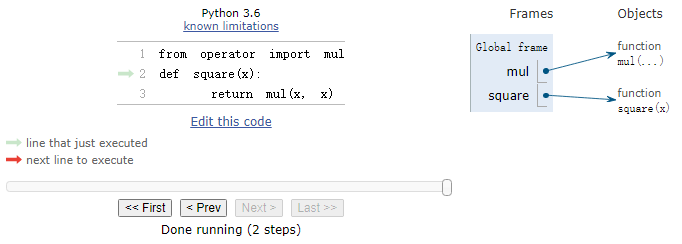

# Chapter 1 Building Abstractions with Functions
## 1.1 Getting Started
### 1.1.1 Programming in Python
### 1.1.2 Installing Python 3
### 1.1.3 Interactive Sessions
* Type `python3` at a terminal window will start an interactive session.
* If you see the Python prompt `>>>`, then you have successfully started an interactive session.
* Each session keeps a history of what you have typed.
* `ctrl + d`: exit a session.
* `ctrl + p` or up arrow, `ctrl + n` or down arrow: access history
### 1.1.4 First Example
* Statesments & Expressions
    * Python code consists of expressions and statements. Broadly, computer programs consist of instructions to either compute some value or carry out some action.
* Functions
    * Functions encapsulate(封装) logic that manipulates data.
* Objects
    * An object seamlessly(无缝) bundles together data and the logic that manipulates that data, in a way that manages the complexity of both.
* Interpreters
    *  A program that implements such a procedure, evaluating(计算) compound(复合的) expressions, is called an interpreter.
```python
# load functionality for accessing data on the Internet
>>> from urllib.request import urlopen

# assignment statement
>>> shakespeare = urlopen('http://composingprograms.com/shakespeare.txt')
>>> words = set(shakespeare.read().decode().split())

# w[::-1] in words 检查该单词的反转形式是否存在于原集合中
>>> {w for w in words if len(w) == 6 and w[::-1] in words}
{'redder', 'drawer', 'reward', 'diaper', 'repaid'}
```
### 1.1.5 Errors
* Learning to interpret errors and diagnose the cause of unexpected errors is called debugging. Some guiding principles of debugging are:
    * Test incrementally
    * Isolate errors(隔离错误)
    * Check your assumptions
    * Consult(咨询) others
## 1.2 Elements of Programming
Every powerful language has three such mechanisms:
* primitive expressions and statements, which represent the simplest building blocks that the language provides,
* means of combination, by which compound elements are built from simpler ones
* means of abstraction, by which compound elements can be named and manipulated as units.
### 1.2.1 Expressions
```python
>>> 42
42

>>> -1 - -1
0

>>> 1/2 + 1/4 + 1/8 + 1/16 + 1/32 + 1/64 + 1/128
0.9921875
```
### 1.2.2 Call Exressions
```python
>>> max(7.5, 9.5)
9.5
```

### 1.2.3 Importing Library Functions
```python
>>> from math import sqrt
>>> sqrt(256)
16.0

>>> from operator import add, sub, mul
>>> add(14, 28)
42
>>> sub(100, mul(7, add(8, 4)))
16
```
[Python3 Library Docs](https://docs.python.org/3/library/index.html)
### 1.2.4 Names and the Environment
* If a value has been given a name, we say that the name binds to the value.
```python
>>> radius = 10
>>> radius
10
>>> 2 * radius
20

# Names are also bound via import statements
>>> from math import pi
>>> pi * 71 / 223
1.0002380197528042
```
* Names can also be bound to functions.
```python
>>> max
<built-in function max>

# We can use assignment statements to give new names to existing functions
>>> f = max
>>> f
<built-in function max>
>>> f(2, 3, 4)
4

# And successive assignment statements can rebind a name to a new value
>>> f = 2
>>> f
2
```
* When a name is bound to a new value through assignment, it is no longer bound to any previous value. One can even bind built-in names to new values.
```python
# After assigning max to 5, the name max is no longer bound to a function, and so attempting to call max(2, 3, 4) will cause an error
>>> max = 5
>>> max
5
```
* When executing an assignment statement, Python evaluates(计算) the expression to the right of `=` before changing the binding to the name on the left. Therefore, one can refer to a name in right-side expression, even if it is the name to be bound by the assignment statement.
```python
>>> x = 2
>>> x = x + 1
>>> x
3
```
* We can also assign multiple values to multiple names in a single statement, where names on the left of `=` and expressions on the right of `=` are separated by commas.
```python
>>> area, circumference = pi * radius * radius, 2 * pi * radius
>>> area
314.1592653589793
>>> circumference
62.83185307179586
```
* With multiple assignment, all expressions to the right of `=` are evaluated before any names to the left are bound to those values. As a result of this rule, swapping the values bound to two names can be performed in a single statement.
```python
>>> x, y = 3, 4.5
>>> y, x = x, y
>>> x
4.5
>>> y
3
```
### 1.2.5 Evaluating Nested Expressions(计算嵌套表达式)
```python
>>> sub(pow(2, add(1, 10)), pow(2, 5))
2016
```

### 1.2.6 The Non-Pure Print Function
* Pure functions
    * Functions have some input (their arguments) and return some output (the result of applying them).
    * Pure functions have the property(特性) that applying them has no effects beyond returning a value.
    * A pure function must always return the same value when called twice with the same arguments.
* Non-pure functions
    * In addition to returning a value, applying a non-pure function can generate side effects, which make some change to the state of the interpreter or computer.
    * A common side effect is to generate additional output beyond the return value, using the `print` function.
    * The value that `print` returns is always `None`, a special Python value that represents nothing.
    * `None` is not displayed by the interpreter as the value of an expression.
    ```python
    >>> print(print(1), print(2))
    1
    2
    None None

    >>> two = print(2)
    2
    >>> print(two)
    None
    ```
## 1.3 Defining New Functions
* Function definitions consist of a `def` statement that indicates a `<name>` and a comma-separated list of named `<formal parameters>`, then a `return` statement, called the function body, that specifies the `<return expression>` of the function, which is an expression to be evaluated whenever the function is applied
```python
def <name>(<formal parameters>):
    return <return expression>
```
```python
>>> def square(x):
        return mul(x, x)

>>> square(21)
441
>>> square(add(2, 5))
49
>>> square(square(3))
81
```
```python
>>> def sum_squares(x, y):
        return add(square(x), square(y))
>>> sum_squares(3, 4)
25
```
```python
>>> def g():
        return 1
>>> g()
1
>>> g = 2
>>> g
2
>>> def g(h, i):
        return h + i
>>> g(1, 2)
3
```
### 1.3.1 Environments
[Online Python Tutor](https://pythontutor.com/cp/composingprograms.html#mode=edit)


### 1.3.2 Calling User-Defined Functions

* Procedure for calling/applying user-defined functions:
  * Add a local frame, forming a new environment
  * Bind the function's formal parameters to its arguments in that frame
  * Execute the body of the function in that new environment
### 1.3.3 Example: Calling a User-Defined Function

* Names are bound to values, which are distributed(分布) across many independent local frames, along with a single global frame that contains shared names. A new local frame is introduced every time a function is called, even if the same function is called twice.
* A name evaluates to the value bound to that name in the earliest frame of the current environment in which that name is found.(先在local frame中找，找不到再去global frame中找)
### 1.3.4 Local Names
* A function should be independent of the parameter names chosen by its author.
### 1.3.5 Choosing Names
* Function names are lowercase, with words separated by underscores. Descriptive names are encouraged.
* Function names typically evoke(唤起) operations applied to arguments by the interpreter or the name of the quantity(数量) that results.
* Parameter names are lowercase, with words separated by underscores. Single-word names are preferred.
* Parameter names should evoke the role of the parameter in the function, not just the kind of argument that is allowed.
* Single letter parameter names are acceptable when their role is obvious, but avoid "l" (lowercase ell), "O" (capital oh), or "I" (capital i) to avoid confusion with numerals.
### 1.3.6 Functions as Abstractions
* A function definition should be able to suppress details.
* Aspects of a functional abstraction.
    * To master the use of a functional abstraction, it is often useful to consider its three core attributes.
        * The domain of a function is the set of arguments it can take.
        * The range of a function is the set of values it can return.
        * The intent of a function is the relationship it computes between inputs and output (as well as any side effects it might generate).
    * Understanding functional abstractions via their domain, range, and intent is critical to using them correctly in a complex program.
### 1.3.7 Operators
* Python expressions with infix(中缀) operators each have their own evaluation procedures, but you can often think of them as short-hand for call expressions.
```python
>>> 2 + 3
5
>>> add(2, 3)
5

>>> 2 + 3 * 4 + 5
19
>>> add(add(2, mul(3, 4)), 5)
19

>>> (2 + 3) * (4 + 5)
45
>>> mul(add(2, 3), add(4, 5))
45

# / operator: normal division
>>> 5 / 4
1.25
>>> 8 / 4
2.0

# // operator: rounds the result down to an integer（向下取整，即向负无穷方向取整）
>>> 5 // 4
1
>>> -5 // 4
-2
>>> from operator import truediv, floordiv
>>> truediv(5, 4)
1.25
>>> floordiv(5, 4)
1

# i * i
>>> i ** 2
```
## 1.4 Designing Functions
* Each function should have exactly one job. That job should be identifiable with a short name and characterizable in a single line of text. Functions that perform multiple jobs in sequence should be divided into multiple functions.
* Don't repeat yourself is a central tenet of software engineering.
* Functions should be defined generally. Squaring is not in the Python Library precisely because it is a special case of the pow function, which raises numbers to arbitrary(任意) powers.
### 1.4.1 Documentation
* A function definition will often include documentation describing the function, called a docstring. Docstrings are conventionally triple quoted(三引号).
* Comments in Python can be attached to the end of a line following the `#` symbol.
```python
>>> def pressure(v, t, n):
        """Compute the pressure in pascals of an ideal gas.
        
        Applies the ideal gas law: http://en.wikipedia.org/wiki/Ideal_gas_law
        
        v -- volume of gas, in cubic meters
        t -- absolute temperature in degrees kelvin
        n -- particles of gas
        """
        k = 1.38e-23  # Boltzmann's constant
        return n * k * t / v
```
* When you call `help` with the name of a function as an argument, you see its docstring (type `q` to quit Python help).
```python
>>> help(pressure)
```
### 1.4.2 Default Argument Values
* In Python, we can provide default values for the arguments of a function. When calling that function, arguments with default values are optional. If they are not provided, then the default value is bound to the formal parameter name(形参) instead. 
```python
>>> def pressure(v, t, n=6.022e23):
        """Compute the pressure in pascals of an ideal gas.

        v -- volume of gas, in cubic meters
        t -- absolute temperature in degrees kelvin
        n -- particles of gas (default: one mole)
        """
        k = 1.38e-23  # Boltzmann's constant
        return n * k * t / v

>>> pressure(1, 273.15)
2269.974834
>>> pressure(1, 273.15, 3 * 6.022e23)
6809.924502
```
## 1.5 Control
### 1.5.1 Statements
### 1.5.2   Compound Statements（复合语句）
* A simple statement is a single line that doesn't end in a colon(冒号). A compound statement is so called because it is composed of other statements (simple and compound). Compound statements typically span multiple lines and start with a one-line header ending in a colon, which identifies the type of statement. Together, a header and an indented suite of statements is called a clause(子句). A compound statement consists of one or more clause
```python
<header>:
    <statement>
    <statement>
    ...
<separating header>:
    <statement>
    <statement>
    ...
```
* We can understand the statements we have already introduced in these terms.
	* Expressions, return statements, and assignment statements are simple statements.
	* A def statement is a compound statement. The suite that follows the def header defines the function body.
* 使用空格进行缩进
### 1.5.3   Defining Functions II: Local Assignment

### 1.5.4   Conditional Statements
* Conditional statuements
```python
if <expression>:
    <suite>
elif <expression>:
    <suite>
else:
    <suite>
```
* Boolean contexts: Python includes several false values, including `0`, `None`, and the boolean value `False`. All other numbers are true values.
* Boolean values: Python has two boolean values, called `True` and `False`.
* Boolean operators
```python
>>> True and False
False
>>> True or False
True
>>> not False
True
```
```python
def if_(c, t, f):
    if c:
        return t
    else:
        return f

from math import sqrt

# real_sqrt(-16)会报错
# 原因：函数参数在调用前被立即求值，导致即使条件不满足也会执行sqrt(x)
def real_sqrt(x):
    """Return the real part of the square root of x."""
    return if_(x >= 0. sqrt(x), 0)
```
### 1.5.5   Iteration
```python
while <expression>:
    <suite>
```
### 1.5.6   Testing
* Assertions: An `assert` statement has an expression in a boolean context, followed by a quoted line of text (single or double quotes are both fine, but be consistent) that will be displayed if the expression evaluates to a false value.
```python
>>> assert fib(8) == 13, 'The 8th Fibonacci number should be 13'
```
* Doctests
	* Python 提供了一种便捷的方法，可以直接在函数的文档字符串（docstring）中嵌入简单的测试用例。文档字符串的首行应为函数的简要描述，随后留空一行，再详细说明参数和功能。此外，文档字符串可包含调用函数的交互式示例
	```python
	>>> def sum_naturals(n):
            """返回前 n 个自然数的和。
        
            >>> sum_naturals(10)
            55
            >>> sum_naturals(100)
            5050
            """
            total, k = 0, 1
            while k <= n:
                total, k = total + k, k + 1
            return total
    ```
    * 通过 `doctest` 模块可自动验证代码是否符合文档中的示例行为
    ```python
    >>> from doctest import testmod
    >>> testmod()
    # 输出：TestResults(failed=0, attempted=2)（表示 2 个测试均通过）
    # testmod() 会自动扫描当前模块中所有函数的文档字符串，执行嵌入的测试用例。若输出 failed=0，则表明所有测试通过
    ```
    * 若需单独验证某个函数的文档字符串测试，可使用 `run_docstring_examples`
    ```python
    >>> from doctest import run_docstring_examples
    # 第一个参数：待测试的函数（如 sum_naturals）；
	# 第二个参数：globals() 返回当前全局变量字典，确保测试在正确的命名空间中执行；
	# 第三个参数：True 表示启用详细模式，输出每条测试的执行结果
	>>> run_docstring_examples(sum_naturals, globals(), True)
	Finding tests in NoName
	Trying:
	    sum_naturals(10)
	Expecting:
	    55
	ok
	Trying:
	    sum_naturals(100)
	Expecting:
	    5050
	ok
    ```
    * 在文件中编写所有测试后，可通过命令行批量执行
    ```shell
    python3 -m doctest <python_source_file>
    ```
* `globals()` 是 Python 的内置函数，它会返回一个字典，表示当前作用域下的全局符号表（全局命名空间）。这个字典包含了当前模块中定义的所有全局变量、函数、类等对象的名称及其对应的值
## 1.6 Higher-Order Functions
### 1.6.1 Functions as Arguments

* How to draw an environment diagram:
	* When a fuction is defined
		* Create a function value: `func name(<formal parameters>) [parent = <parent>]`
		* Its parent is the current frame 
		* Bind `<name>`  to the function value in the current frame
	* When a function is called
		* Add a local frame, titled with the `<name>` of the function being called
		* Copy the parent of the function to the local frame: `[parent=<label>]` 	
		* Bind the `<formal parameters>` to the arguments in the local frame
		* Execute the body of the function in the environment that starts with the local frame
### 1.6.2 Functions as General Methods
```python
def improve(update, close, guess=1):
    while not close(guess):
        guess = update(guess)
    return guess

def golden_update(guess):
    return 1/guess + 1

def square_close_to_successor(guess):
    return approx_eq(guess * guess,
                     guess + 1)

def approx_eq(x, y, tolerance=1e-3):
    return abs(x - y) < tolerance

phi = improve(golden_update,
              square_close_to_successor)
```
### 1.6.3 Defining Functions III: Nested Definitions
* Each user-defined function has a parent environment: the environment in which it was defined.
* When a user-defined function is called, its local frame extends its parent environment.

* 当嵌套函数尝试修改外部函数的参数n时，需要添加`nonlocal`声明
```python
def make_repeater(f, n):
    """Returns the function that computes the nth application of f.

    >>> add_three = make_repeater(increment, 3)
    >>> add_three(5)
    8
    >>> make_repeater(triple, 5)(1) # 3 * 3 * 3 * 3 * 3 * 1
    243
    >>> make_repeater(square, 2)(5) # square(square(5))
    625
    >>> make_repeater(square, 3)(5) # square(square(square(5)))
    390625
    """
    "*** YOUR CODE HERE ***"
    def repeater(x):
        nonlocal n
        if n == 0:
            return x
        n -= 1
        return repeater(f(x))
    return repeater 
```
### 1.6.4 Functions as Returned Values
* Functions defined within other function bodies are bound to names in a local frame.

### 1.6.5 Example: Newton's Method
### 1.6.6 Currying
* Currying: Transforming a multi-argument function into a single -argument, higher-order function


```python
def curry2(f):
	def g(x):
		def h(y):
			return f(x, y)
		return h
	return g

>>> from operator import add
>>> m = curry2(add)
>>> add_three = m(3)
>>> add_three(2)
>>> 5

>>> curry2 = lambda f: lambda x: lambda y: f(x, y)
```
### 1.6.7 Lambda expressions
* A lambda expression evaluates to a function that has a single return expression as its body. Assignment and control statements are not allowed.
```python
# A function that takes x and returns f(g(x))"
>>> def compose1(f, g):
        return lambda x: f(g(x))
```
```python
>>> s = lambda x: x * x
>>> s
<function <lambda> at 0xf3f490>
>>> s(12)
144
```

```python
a = 1
def f(g):
	a = 2
	return lambda y: a * g(y) # 这里lambda的parent为f1, 因此a为2
f(lambda y: a + y)(a) # 这里lambda的parent为global, 因此a为1; operator a也为1
```
### 1.6.8   Abstractions and First-Class Functions
### 1.6.9   Function Decorators
* 装饰器：用于动态修改或增强其他函数的行为，其核心思想是：
  * 输入：接受一个函数作为参数
  * 输出：返回一个新的函数（通常是对原函数的包装）
```python
# 定义装饰器trace
# 功能：当调用被装饰的函数时，会先打印函数名和参数，再执行原函数
# 参数：fn是被装饰的原函数
# 返回：闭包wrapped，它包裹了原函数fn并添加了打印逻辑
def trace(fn):
    def wrapped(x):
        print('-> ', fn, '(', x, ')')
        return fn(x)  # 调用原函数并返回结果
    return wrapped  # 返回包装后的函数

# 应用装饰器
@trace
def triple(x):
    return 3 * x

# 等价代码
def triple(x):
    return 3 * x
triple = trace(triple)  # 手动应用装饰器

# 调用被装饰的函数
triple(12)
# 输出：
# ->  <function triple at 0x102a39848> ( 12 )
# 36
```
```python
# 装饰器本质
def original_function(...): ...
original_function = decorator(original_function)
```
```python
# *args，它表示传递给函数的所有参数
>>> def printed(f):
        def print_and_return(*args):
            result = f(*args)
            print('Result:', result)
            return result
        return print_and_return
>>> printed_pow = printed(pow)
>>> printed_pow(2, 8)
Result: 256
256
>>> printed_abs = printed(abs)
>>> printed_abs(-10)
Result: 10
10
```
* Error & Tracebacks
	* syntax errors: Python can detect before it even starts executing the program.
	* runtime errors: These are errors that are detected by the Python interpreter while the program is executing.
	* logical or behavior error
* If `and` and `or` do not short-circuit, they just return the last value; another way to remember this is that `and` and `or` always return the last thing they evaluate, whether they short circuit or not.
```python
>>> True and 13
______13
>>> False or 0
______0
>>> not 10
______False
>>> not None
______True
>>> True and 1 / 0
______Error (ZeroDivisionError)
>>> True or 1 / 0
______True
>>> -1 or 5
______-1
>>> (1 + 1) and 1
______1
>>> print(3) or ""
______3
''
```
```python
n = 7  # 全局变量 n = 7

def f(x):        # 定义函数 f（后续被覆盖）
    n = 8        # 局部变量 n = 8（不影响全局）
    return x + 1 # 返回 x+1

def g(x):        # 定义函数 g
    n = 9        # 局部变量 n = 9
    def h():     # 定义内部函数 h
        return x + 1  # h 捕获闭包变量 x
    return h     # 返回函数 h（携带闭包变量 x）

def f(f, x):     # 定义新函数 f（覆盖之前的同名函数）
    return f(x + n)  # 调用传入的 f 函数，参数是 x + 全局 n（7）

# 执行逻辑开始
f = f(g, n)      # 调用新 f，参数是 g 和全局 n=7，返回 g(7+7)=g(14)
g = (lambda y: y())(f)  # 调用 lambda 函数，执行 f()（即 h()）
```
## 1.7   Recursive Functions
### 1.7.1 The Anatomy of Recursive Functions(递归函数剖析)
* The def statement header is similar to other functions
* Conditional statements check for base cases
* Base cases are evaluated without recursive calls
* Recursivve cases are evaluated with recursive calls
### 1.7.2 Mutual Recursion(相互递归)
```python
def is_even(n):
	if n == 0:
		return True
	else:
		return is_odd(n - 1)
def is_odd(n):
	if n == 0:
		return False
	else:
		return is_even(n - 1)

result = is_even(4)
```
### 1.7.3 Printing in Recursive Functions
### 1.7.4 Tree Recursion
### 1.7.5 Example: Partitions
```python
def count_partitions(n, m):
	 """Count the ways to partition n using parts up to m."""
	 if n == 0:
	     return 1 
	 elif n < 0:
	     return 0
	 elif m == 0:
	     return 0
	 else:
	     return count_partitions(n-m, m) + count_partitions(n, m-1)
```
```python
# write a function that prints an inverse cascade
# 1
# 12
# 123
# 1234
# 123
# 12
# 1

def inverse_cascade(n):
	grow(n)
	print(n)
	shrink(n)

def f_then_g(f, g, n):
	if n:
		f(n)
		g(n)

grow = lambda n: f_then_g(grow, print, n // 10)
shrink = lambda n: f_then_g(print, shrink, n // 10)
```