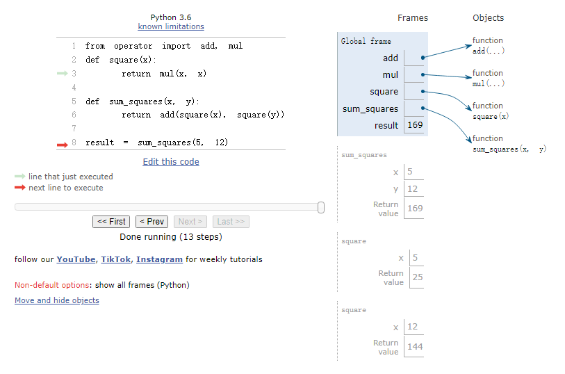
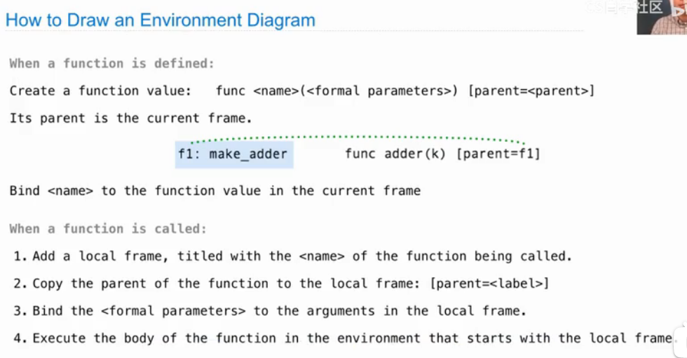

# Chapter 1 Building Abstractions with Functions
## 1.1 Getting Started
### 1.1.1 Programming in Python
### 1.1.2 Installing Python 3
### 1.1.3 Interactive Sessions
* Type `python3` at a terminal window will start an interactive session.
* If you see the Python prompt `>>>`, then you have successfully started an interactive session.
* Each session keeps a history of what you have typed.
* `ctrl + d`: exit a session.
* `ctrl + p` or up arrow, `ctrl + n` or down arrow: access history
### 1.1.4 First Example
* Statesments & Expressions
    * Python code consists of expressions and statements. Broadly, computer programs consist of instructions to either compute some value or carry out some action.
* Functions
    * Functions encapsulate(封装) logic that manipulates data.
* Objects
    * An object seamlessly(无缝) bundles together data and the logic that manipulates that data, in a way that manages the complexity of both.
* Interpreters
    *  A program that implements such a procedure, evaluating(计算) compound(复合的) expressions, is called an interpreter.
```python
# load functionality for accessing data on the Internet
>>> from urllib.request import urlopen

# assignment statement
>>> shakespeare = urlopen('http://composingprograms.com/shakespeare.txt')
>>> words = set(shakespeare.read().decode().split())

# w[::-1] in words 检查该单词的反转形式是否存在于原集合中
>>> {w for w in words if len(w) == 6 and w[::-1] in words}
{'redder', 'drawer', 'reward', 'diaper', 'repaid'}
```
### 1.1.5 Errors
* Learning to interpret errors and diagnose the cause of unexpected errors is called debugging. Some guiding principles of debugging are:
    * Test incrementally
    * Isolate errors(隔离错误)
    * Check your assumptions
    * Consult(咨询) others
## 1.2 Elements of Programming
Every powerful language has three such mechanisms:
* primitive expressions and statements, which represent the simplest building blocks that the language provides,
* means of combination, by which compound elements are built from simpler ones
* means of abstraction, by which compound elements can be named and manipulated as units.
### 1.2.1 Expressions
```python
>>> 42
42

>>> -1 - -1
0

>>> 1/2 + 1/4 + 1/8 + 1/16 + 1/32 + 1/64 + 1/128
0.9921875
```
### 1.2.2 Call Exressions
```python
>>> max(7.5, 9.5)
9.5
```

### 1.2.3 Importing Library Functions
```python
>>> from math import sqrt
>>> sqrt(256)
16.0

>>> from operator import add, sub, mul
>>> add(14, 28)
42
>>> sub(100, mul(7, add(8, 4)))
16
```
[Python3 Library Docs](https://docs.python.org/3/library/index.html)
### 1.2.4 Names and the Environment
* If a value has been given a name, we say that the name binds to the value.
```python
>>> radius = 10
>>> radius
10
>>> 2 * radius
20

# Names are also bound via import statements
>>> from math import pi
>>> pi * 71 / 223
1.0002380197528042
```
* Names can also be bound to functions.
```python
>>> max
<built-in function max>

# We can use assignment statements to give new names to existing functions
>>> f = max
>>> f
<built-in function max>
>>> f(2, 3, 4)
4

# And successive assignment statements can rebind a name to a new value
>>> f = 2
>>> f
2
```
* When a name is bound to a new value through assignment, it is no longer bound to any previous value. One can even bind built-in names to new values.
```python
# After assigning max to 5, the name max is no longer bound to a function, and so attempting to call max(2, 3, 4) will cause an error
>>> max = 5
>>> max
5
```
* When executing an assignment statement, Python evaluates(计算) the expression to the right of `=` before changing the binding to the name on the left. Therefore, one can refer to a name in right-side expression, even if it is the name to be bound by the assignment statement.
```python
>>> x = 2
>>> x = x + 1
>>> x
3
```
* We can also assign multiple values to multiple names in a single statement, where names on the left of `=` and expressions on the right of `=` are separated by commas.
```python
>>> area, circumference = pi * radius * radius, 2 * pi * radius
>>> area
314.1592653589793
>>> circumference
62.83185307179586
```
* With multiple assignment, all expressions to the right of `=` are evaluated before any names to the left are bound to those values. As a result of this rule, swapping the values bound to two names can be performed in a single statement.
```python
>>> x, y = 3, 4.5
>>> y, x = x, y
>>> x
4.5
>>> y
3
```
### 1.2.5 Evaluating Nested Expressions(计算嵌套表达式)
```python
>>> sub(pow(2, add(1, 10)), pow(2, 5))
2016
```

### 1.2.6 The Non-Pure Print Function
* Pure functions
    * Functions have some input (their arguments) and return some output (the result of applying them).
    * Pure functions have the property(特性) that applying them has no effects beyond returning a value.
    * A pure function must always return the same value when called twice with the same arguments.
* Non-pure functions
    * In addition to returning a value, applying a non-pure function can generate side effects, which make some change to the state of the interpreter or computer.
    * A common side effect is to generate additional output beyond the return value, using the `print` function.
    * The value that `print` returns is always `None`, a special Python value that represents nothing.
    * `None` is not displayed by the interpreter as the value of an expression.
    ```python
    >>> print(print(1), print(2))
    1
    2
    None None

    >>> two = print(2)
    2
    >>> print(two)
    None
    ```
## 1.3 Defining New Functions
* Function definitions consist of a `def` statement that indicates a `<name>` and a comma-separated list of named `<formal parameters>`, then a `return` statement, called the function body, that specifies the `<return expression>` of the function, which is an expression to be evaluated whenever the function is applied
```python
def <name>(<formal parameters>):
    return <return expression>
```
```python
>>> def square(x):
        return mul(x, x)

>>> square(21)
441
>>> square(add(2, 5))
49
>>> square(square(3))
81
```
```python
>>> def sum_squares(x, y):
        return add(square(x), square(y))
>>> sum_squares(3, 4)
25
```
```python
>>> def g():
        return 1
>>> g()
1
>>> g = 2
>>> g
2
>>> def g(h, i):
        return h + i
>>> g(1, 2)
3
```
### 1.3.1 Environments
[Online Python Tutor](https://pythontutor.com/cp/composingprograms.html#mode=edit)



### 1.3.2 Calling User-Defined Functions

* Procedure for calling/applying user-defined functions:
  * Add a local frame, forming a new environment
  * Bind the function's formal parameters to its arguments in that frame
  * Execute the body of the function in that new environment
### 1.3.3 Example: Calling a User-Defined Function



* Names are bound to values, which are distributed(分布) across many independent local frames, along with a single global frame that contains shared names. A new local frame is introduced every time a function is called, even if the same function is called twice.
* A name evaluates to the value bound to that name in the earliest frame of the current environment in which that name is found.(先在local frame中找，找不到再去global frame中找)
### 1.3.4 Local Names
* A function should be independent of the parameter names chosen by its author.
### 1.3.5 Choosing Names
* Function names are lowercase, with words separated by underscores. Descriptive names are encouraged.
* Function names typically evoke(唤起) operations applied to arguments by the interpreter or the name of the quantity(数量) that results.
* Parameter names are lowercase, with words separated by underscores. Single-word names are preferred.
* Parameter names should evoke the role of the parameter in the function, not just the kind of argument that is allowed.
* Single letter parameter names are acceptable when their role is obvious, but avoid "l" (lowercase ell), "O" (capital oh), or "I" (capital i) to avoid confusion with numerals.
### 1.3.6 Functions as Abstractions
* A function definition should be able to suppress details.
* Aspects of a functional abstraction.
    * To master the use of a functional abstraction, it is often useful to consider its three core attributes.
        * The domain of a function is the set of arguments it can take.
        * The range of a function is the set of values it can return.
        * The intent of a function is the relationship it computes between inputs and output (as well as any side effects it might generate).
    * Understanding functional abstractions via their domain, range, and intent is critical to using them correctly in a complex program.
### 1.3.7 Operators
* Python expressions with infix(中缀) operators each have their own evaluation procedures, but you can often think of them as short-hand for call expressions.
```python
>>> 2 + 3
5
>>> add(2, 3)
5

>>> 2 + 3 * 4 + 5
19
>>> add(add(2, mul(3, 4)), 5)
19

>>> (2 + 3) * (4 + 5)
45
>>> mul(add(2, 3), add(4, 5))
45

# / operator: normal division
>>> 5 / 4
1.25
>>> 8 / 4
2.0

# // operator: rounds the result down to an integer（向下取整，即向负无穷方向取整）
>>> 5 // 4
1
>>> -5 // 4
-2
>>> from operator import truediv, floordiv
>>> truediv(5, 4)
1.25
>>> floordiv(5, 4)
1

# i * i
>>> i ** 2
```
