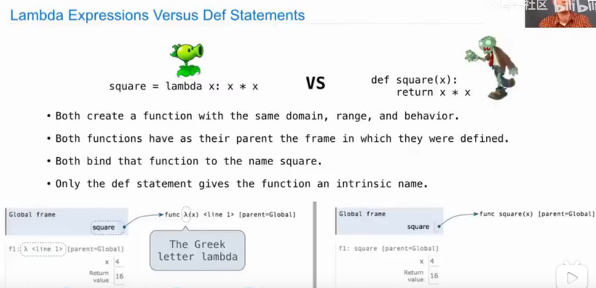
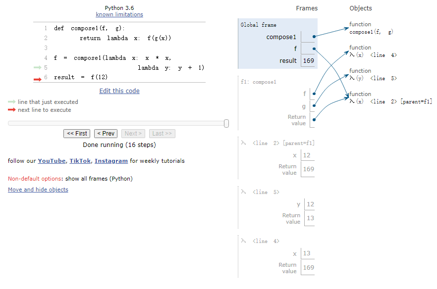
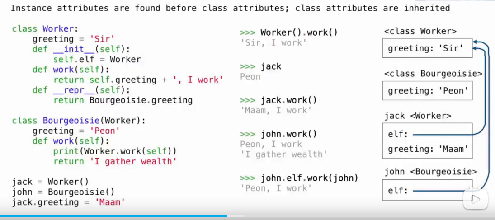
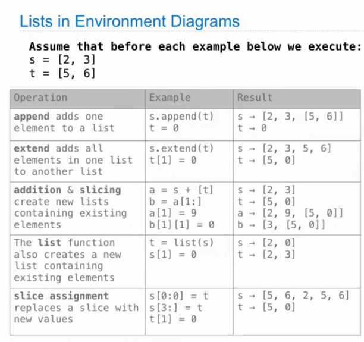
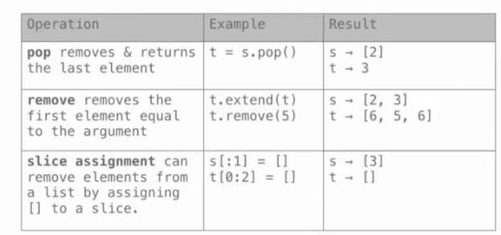
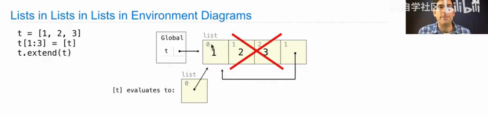
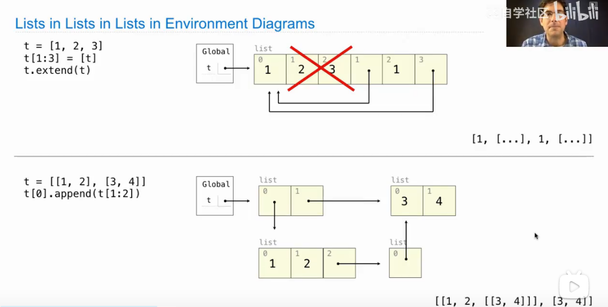

# Chapter 2: Building Abstractions with Data
## 2.1   Introduction
### 2.1.1   Native Data Types
* Every value in Python has a `class` that determines what type of value it is.
* Python includes three native numeric types: integers (`int`), real numbers (`float`), and complex numbers (`complex`).
```python
>>> type(2)
<class 'int'>
>>> type(1.5)
<class 'float'>
>>> type(1+1j)
<class 'complex'>

>>> type(1/3)
<class 'float'>
>>> 1/3
0.3333333333333333
>>> 1/3 == 0.333333333333333312345  # Beware of float approximation
True
```
## 2.2   Data Abstraction
### 2.2.1   Example: Rational Numbers
```python
>>> def add_rationals(x, y):
        nx, dx = numer(x), denom(x)
        ny, dy = numer(y), denom(y)
        return rational(nx * dy + ny * dx, dx * dy)
>>> def mul_rationals(x, y):
        return rational(numer(x) * numer(y), denom(x) * denom(y))
>>> def print_rational(x):
        print(numer(x), '/', denom(x))
>>> def rationals_are_equal(x, y):
        return numer(x) * denom(y) == numer(y) * denom(x)
```
### 2.2.2 Pairs
* Python provides a compound structure called a `list`, which can be constructed by placing expressions within square brackets separated by commas. 
```python
>>> pair = [10, 20]
>>> pair
[10, 20]
>>> x, y = pair
>>> x
10
>>> y
20
>>> pair[0]
10
>>> pair[1]
20
>>> getitem(pair, 0)
10
>>> getitem(pair, 1)
20
# 负索引从列表末尾开始计数，最右边元素的索引是-1
>>> pair[-1]
20
```
```python
>>> from fractions import gcd # 最大公约数
>>> def rational(n, d):
        g = gcd(n, d)
        return (n//g, d//g)
>>> def numer(x):
        return x[0]
>>> def denom(x):
        return x[1]
```
### 2.2.3   Abstraction Barriers
### 2.2.4   The Properties of Data
## 2.3 Sequences
* Sequences are not instances of a particular built-in type or abstract data representation, but instead a collection of behaviors that are shared among several different types of data. That is, there are many kinds of sequences, but they all share common behavior.
	* Length. A sequence has a finite length. An empty sequence has length 0.
	* Element selection. A sequence has an element corresponding to any non-negative integer index less than its length, starting at 0 for the first element.
### 2.3.1 Lists
```python
>>> digits = [1, 8, 2, 8]
>>> len(digits)
4
```
* For sequences, addition and multiplication do not add or multiply elements, but instead combine and replicate the sequences themselves.
```python
>>> [2, 7] + digits * 2
[2, 7, 1, 8, 2, 8, 1, 8, 2, 8]
```
* Any values can be included in a list, including another list.
```python
>>> pairs = [[10, 20], [30, 40]]
>>> pairs[1]
[30, 40]
>>> pairs[1][0]
30
```
### 2.3.2 Sequence Iteration
```python
>>> def count(s, value):
        """Count the number of occurrences of value in sequence s."""
        total = 0
        for elem in s:
            if elem == value:
                total = total + 1
        return total

>>> pairs = [[1, 2], [2, 2], [2, 3], [4, 4]]
>>> same_count = 0
>>>> for x, y in pairs:
        if x == y:
            same_count = same_count + 1
```
```python
for <name> in <expression>:
    <suite>
```
* A `for` statement is executed by the following procedure:
	* Evaluate the header `<expression>`, which must yield an iterable value.
	* For each element value in that iterable value, in order:
		* Bind `<name>` to that value in the current frame.
		* Execute the `<suite>`.
* A range is a sequence of consecutive integers(连续整数的序列).
* range is sequence but not list.
```python
>>> range(1, 10)  # Includes 1, but not 10
range(1, 10)
>>> list(range(5, 8))
[5, 6, 7]
>>> list(range(4))
[0, 1, 2, 3]

# This underscore is just another name in the environment as far as the interpreter is concerned, but has a conventional meaning among programmers that indicates the name will not appear in any future expressions.
>>> for _ in range(3):
        print('Go Bears!')

Go Bears!
Go Bears!
Go Bears!

# 构造嵌套lists
lists = [[] for _ in range(3)]
```
### 2.3.3 Sequence Processing
* List Comprehensions(列表推导式)
	*  `[<map expression> for <name> in <sequence expression> if <filter expression>]`
	* To evaluate a list comprehension, Python evaluates the `<sequence expression>`, which must return an iterable value. Then, for each element in order, the element value is bound to `<name>`, the filter expression is evaluated, and if it yields a true value, the map expression is evaluated. The values of the map expression are collected into a list.
```python
>>> odds = [1, 3, 5, 7, 9]
>>> [x+1 for x in odds]
[2, 4, 6, 8, 10]

>>> [x for x in odds if 25 % x == 0]
[1, 5]

>>> [[1] + s for s in [[4], [5, 6]]]
[[1, 4], [1, 5, 6]]
```
### 2.3.4   Sequence Abstraction
```python
>>> digits
[1, 8, 2, 8]
>>> 2 in digits
True
>>> 1828 not in digits
True
```
```python
>>> digits[0:2]
[1, 8]
>>> digits[1:]
[8, 2, 8]
>> digits[:2]
[1, 8]
>> digits[:]
[1, 8, 2, 8]
```
* `sum(iterable[, start]) -> value`
	* Return the sum of an iterable of numbers plus the calue of parameter 'start' (which defaults to 0). When the iterable is empty, return start. 	
```python
>>> sum([2, 3, 4])
9
>>> sum([2, 3, 4], 5)
14
>>> sum([[2, 3], [4]], [])
[2, 3, 4]

>>> sum([[1], [2, 3], [4]], [])
[1, 2, 3, 4]
>>> sum([[1]], [])
[1]
>>> sum([[[1]], [2]], [])
[[1], 2]
```
* `max(iterable[, key=func]) -> value` `max(a, b, c, ...[, key=func]) -> value`
	* With a single iterable argument, return its largest item.
	* With two or more arguments, return the largest argument.
```python
>>> max(range(5))
4
>>> max(0, 1, 2, 3, 4)
4
>>> max(range(10), key=lambda x: 7-(x-4)*(x-2))
3
```
* `all(iterable) -> bool`
	* Return True if bool(x) is True for all values in the iterable. If the iterable is empty, return True
```python
>>> all([x < 5 for x in range(5)])
True
>>> all(range(5))
False  
```
```python
nums = [5, 2, 1, 4, 1]  # 两个1
min_index = nums.index(min(nums))  # 返回第一个1的位置：2
```
### 2.3.5 Strings
* Python does not have a separate character type; any text is a string, and strings that represent single characters have a length of 1.
* Strings aren't limited to a single line. Triple quotes delimit string literals that span multiple lines.
```python
>>> city = 'Berkeley'
>>> len(city)
8
# an element of a string is itself a string, but with only one element
>>> city[3]
'k'

>>> 'Berkeley' + ', CA'
'Berkeley, CA'
>>> 'Shabu ' * 2
'Shabu Shabu '

# 寻找子字符串
>>> 'here' in "Where's Waldo?"
True

>>> """The Zen of Python
claims, Readability counts.
Read more: import this."""
'The Zen of Python\nclaims, "Readability counts."\nRead more: import this.'

>>> str(2) + ' is an element of ' + str(digits)
'2 is an element of [1, 8, 2, 8]'
```
```python
>>> 'curry = lambda f: lambda x: lambda y: f(x, y)'
'curry = lambda f: lambda x: lambda y: f(x, y)'
>>> exec('curry = lambda f: lambda x: lambda y: f(x, y)')
>>> curry
<function <lambda> at 0x1003c1bf8>
>>> curry(add)(3)(4)
7
```
```python
>>> a = 'A'
>>> ord(a)
65
>>> hex(ord(a))
'0x41'

>>> from unicodedata import name, lookup
>>> name('A')
'LATIN CAPITAL LETTER A'
>>> name('a')
'LATIN SMALL LETTER A'
>>> lookup('LATIN CAPITAL LETTER A')
'A'
>>> lookup('LATIN CAPITAL LETTER A').encode()
b'A'
>>> lookup('BABY').encode()
b'\xf0\x9f\x91\xb6'
```
### 2.3.6 Trees
* A tree has a root label and a list of branches
* Each branch is a tree

```python
# 树的构造函数
def tree(root_label, branches=[]):
     for branch in branches:
         assert is_tree(branch), 'branches must be trees'  # 验证每个分支是否为合法树
     return [root_label] + list(branches)  # 组合根标签与分支列表

# 返回根节点
def label(tree):
    return tree[0]  # 列表首元素即根标签

# 返回所有子树
def branches(tree):
    return tree[1:]  # 列表除首元素外的剩余部分

def is_tree(tree):
	if type(tree) != list or len(tree) < 1:
	    return False
	for branch in branches(tree):
	    if not is_tree(branch):
	        return False
	return True

def is_leaf(tree):
	return not branches(tree)

def fib_tree(n):
	 if n == 0 or n == 1:
	     return tree(n)
	 else:
	     left, right = fib_tree(n-2), fib_tree(n-1)
	     fib_n = label(left) + label(right)
	     return tree(fib_n, [left, right])

def count_leaves(tree):
	if is_leaf(tree):
	     return 1
	 else:
	     branch_counts = [count_leaves(b) for b in branches(tree)]
	     return sum(branch_counts)

def leaves(t):
	"""Return a list containing the leaf labels of tree."""
	if is_leaf(t):
		return [label(t)]
	return sum([leaves(b) for b in branches(t)], [])

def increment_leaves(t):
	"""Return a tree like t but with leaf labels incremented."""
	if is_leaf(t):
		return tree(label(t) + 1)
	else:
		bs = [increment_leaves(b) for b in branches(t)]
		return tree(label(t), bs)

def increment(t):
	"""Return a tree like t but with all labels incremented."""
	return tree(label(t) + 1, [increment(b) for b in branches(t)])

def print_tree(t, indent=0):
	print(' ' * indent + str(label(t)))
	for b in branches(t):
		print_tree(b, indent + 1)

def print_sums(t, so_far):
	if is_leaf(t):
		print(so_far + label(t))
	return [print_sums(b, so_far + label(t)) for b in branches(t)]
	
def count_paths(t, total):
	"""Return the number of paths from the root to any node in tree t for which the labels along the path sum to total."""
	if total - label(t) == 0:
		found = 1
	else:
		found = 0
	return found + sum([count_paths(b, total - label(t)) for b in branches(b)])
```
### 2.3.7   Linked Lists

```python
>>> empty = 'empty'
>>> def is_link(s):
        """s is a linked list if it is empty or a (first, rest) pair."""
        return s == empty or (len(s) == 2 and is_link(s[1]))
>>> def link(first, rest):
        """Construct a linked list from its first element and the rest."""
        assert is_link(rest), "rest must be a linked list."
        return [first, rest]
>>> def first(s):
        """Return the first element of a linked list s."""
        assert is_link(s), "first only applies to linked lists."
        assert s != empty, "empty linked list has no first element."
        return s[0]
>>> def rest(s):
        """Return the rest of the elements of a linked list s."""
        assert is_link(s), "rest only applies to linked lists."
        assert s != empty, "empty linked list has no rest."
        return s[1]
>>> def len_link(s):
        """Return the length of linked list s."""
        length = 0
        while s != empty:
            s, length = rest(s), length + 1
        return length
>>> def getitem_link(s, i):
        """Return the element at index i of linked list s."""
        while i > 0:
            s, i = rest(s), i - 1
        return first(s)
>>> def len_link_recursive(s):
        """Return the length of a linked list s."""
        if s == empty:
            return 0
        return 1 + len_link_recursive(rest(s))
>>> def getitem_link_recursive(s, i):
        """Return the element at index i of linked list s."""
        if i == 0:
            return first(s)
        return getitem_link_recursive(rest(s), i - 1)
```
## 2.4   Mutable Data
### 2.4.1   The Object Metaphor(隐喻)
### 2.4.2   Sequence Objects
* `list` is mutable(可变的) object.
* With mutable data, methods called on one name can affect another name at the same time.
```python
>>> chinese = ['coin', 'string', 'myriad']  # A list literal
>>> suits = chinese                         # Two names refer to the same list
>>> suits.pop()             # Remove and return the final element
'myriad'
>>> suits.remove('string')  # Remove the first element that equals the argument
>>> suits.append('cup')              # Add an element to the end
>>> suits.extend(['sword', 'club'])  # Add all elements of a sequence to the end
>>> suits[2] = 'spade'  # Replace an element
>>> suits
['coin', 'cup', 'spade', 'club']
>>> suits[0:2] = ['heart', 'diamond']  # Replace a slice
>>> suits
['heart', 'diamond', 'spade', 'club']
>>> chinese  # This name co-refers with "suits" to the same changing list
['heart', 'diamond', 'spade', 'club']
 
>>> nest = list(suits)  # Bind "nest" to a second list with the same elements
>>> nest[0] = suits     # Create a nested list
>>> suits.insert(2, 'Joker')  # Insert an element at index 2, shifting the rest
>>> nest
[['heart', 'diamond', 'Joker', 'spade', 'club'], 'diamond', 'spade', 'club']
>>> nest[0].pop(2)
'Joker'
>>> suits
['heart', 'diamond', 'spade', 'club']

# 判断两列表是否指向同一元素
>>> suits is nest[0]
True
>>> suits is ['heart', 'diamond', 'spade', 'club']
False
# 判断两列表是否相等
>>> suits == ['heart', 'diamond', 'spade', 'club']
True
```
```python
def f(s=[]):
	s.append(5)
	return len(s)
f() # 1
f() # 2
f() # 3
```
* `tuple`, is an immutable(不变的) sequence.
```python
>>> 1, 2 + 3
(1, 5)
>>> ("the", 1, ("and", "only"))
('the', 1, ('and', 'only'))
>>> type( (10, 20) )
<class 'tuple'>
>>> ()    # 0 elements
()
>>> (10,) # 1 element
(10,)

>>> code = ("up", "up", "down", "down") + ("left", "right") * 2
>>> len(code)
8
>>> code[3]
'down'
>>> code.count("down")
2
>>> code.index("left")
4
```
```python
>>> s = ([1, 2], 3)
>>> s[0] = 4
ERROR
>>> s[0][0] = 4
>>> s
([4, 2], 3)
```
### 2.4.3   Dictionaries
* Dictionary keys do have two restrictions:
	* A key of a dictionary cannot be a list or a dictionary (or any mutable type)
	* Two keys cannot be equal; There can be at most one value for a given key
* `{<key exp>: <value exp> for <name> in <iter exp> if <filter exp>}`
```python
>>> numerals = {'I': 1.0, 'V': 5, 'X': 10}
>>> numerals['X']
10
>>> list(numerals)
['I', 'V', 'X']
>>> numerals.values()
dict_values([1, 5, 10])
>>> list(numerals.values())
[1, 5, 10]

>>> numerals['I'] = 1
>>> numerals['L'] = 50
>>> numerals
{'I': 1, 'X': 10, 'L': 50, 'V': 5}

>>> sum(numerals.values())
66

>>> dict([(3, 9), (4, 16), (5, 25)])
{3: 9, 4: 16, 5: 25}

# The arguments to get are the key and the default value.
>>> numerals.get('A', 0)
0
>>> numerals.get('V', 0)
5
>>> numerals.pop('X')
```
```python
.keys()
.values()
.items()
# 可以使用 in 关键字来检查字典中是否包含某个键：
```
### 2.4.4   Local State
### 2.4.5   The Benefits of Non-Local Assignment
```python
def make_withdraw(balance):
	def withdraw(amount):
		nonlocal balance
		if amount > balance:
			return 'Insufficient funds'
		balance = balance - amount
		return balance
	return withdraw

wd = make_withdraw(20)
wd2 = make_withdraw(7)
# 修改各自的balance
wd2(6) # balance = 1
wd(8) # balance = 12
```
### 2.4.6   The Cost of Non-Local Assignment
### 2.4.7   Implementing Lists and Dictionaries
```python
>>> def mutable_link():
        """Return a functional implementation of a mutable linked list."""
        contents = empty
        def dispatch(message, value=None):
            nonlocal contents
            if message == 'len':
                return len_link(contents)
            elif message == 'getitem':
                return getitem_link(contents, value)
            elif message == 'push_first':
                contents = link(value, contents)
            elif message == 'pop_first':
                f = first(contents)
                contents = rest(contents)
                return f
            elif message == 'str':
                return join_link(contents, ", ")
        return dispatch

>>> def to_mutable_link(source):
        """Return a functional list with the same contents as source."""
        s = mutable_link()
        for element in reversed(source):
            s('push_first', element)
        return s

>>> def dictionary():
        """Return a functional implementation of a dictionary."""
        records = []
        def getitem(key):
            matches = [r for r in records if r[0] == key]
            if len(matches) == 1:
                key, value = matches[0]
                return value
        def setitem(key, value):
            nonlocal records
            non_matches = [r for r in records if r[0] != key]
            records = non_matches + [[key, value]]
        def dispatch(message, key=None, value=None):
            if message == 'getitem':
                return getitem(key)
            elif message == 'setitem':
                setitem(key, value)
        return dispatch
```
### 2.4.8   Dispatch Dictionaries
### 2.4.9   Propagating Constraints(传播约束）
* 基于约束传播的系统，用于摄氏度和华氏度之间的双向转换。核心思想是通过连接器（connectors）和约束（constraints）构建一个网络，当任一节点的值发生变化时，变化会自动传播到相关节点。

```python
>>> celsius = connector('Celsius')
>>> fahrenheit = connector('Fahrenheit')
>>> def converter(c, f):
        """Connect c to f with constraints to convert from Celsius to Fahrenheit."""
        u, v, w, x, y = [connector() for _ in range(5)]
        multiplier(c, w, u)
        multiplier(v, x, u)
        adder(v, y, f)
        constant(w, 9)
        constant(x, 5)
        constant(y, 32)

>>> converter(celsius, fahrenheit)

>>> celsius['set_val']('user', 25)
Celsius = 25
Fahrenheit = 77.0
>>> fahrenheit['set_val']('user', 212)
Contradiction detected: 77.0 vs 212
>>> celsius['forget']('user')
Celsius is forgotten
Fahrenheit is forgotten
>>> fahrenheit['set_val']('user', 212)
Fahrenheit = 212
Celsius = 100.0
```
* `connector['set_val'](source, value)` indicates that the `source` is requesting the connector to set its current value to `value`.
* `connector['has_val']()` returns whether the connector already has a value.
* `connector['val']` is the current value of the connector.
* `connector['forget'](source)` tells the connector that the `source` is requesting it to forget its value.
* `connector['connect'](source)` tells the connector to participate in a new constraint, the `source`.
* `constraint['new_val']()` indicates that some connector that is connected to the constraint has a new value.
* `constraint['forget']()` indicates that some connector that is connected to the constraint has forgotten its value.
```python
>>> from operator import mul, truediv
>>> def multiplier(a, b, c):
        """The constraint that a * b = c."""
        return make_ternary_constraint(a, b, c, mul, truediv, truediv)

>>> def constant(connector, value):
        """The constraint that connector = value."""
        constraint = {}
        connector['set_val'](constraint, value)
        return constraint

>>> def connector(name=None):
        """A connector between constraints."""
        informant = None
        constraints = []
        def set_value(source, value):
            nonlocal informant
            val = connector['val']
            if val is None:
                informant, connector['val'] = source, value
                if name is not None:
                    print(name, '=', value)
                inform_all_except(source, 'new_val', constraints)
            else:
                if val != value:
                    print('Contradiction detected:', val, 'vs', value)
        def forget_value(source):
            nonlocal informant
            if informant == source:
                informant, connector['val'] = None, None
                if name is not None:
                    print(name, 'is forgotten')
                inform_all_except(source, 'forget', constraints)
        connector = {'val': None,
                     'set_val': set_value,
                     'forget': forget_value,
                     'has_val': lambda: connector['val'] is not None,
                     'connect': lambda source: constraints.append(source)}
        return connector

>>> def inform_all_except(source, message, constraints):
        """Inform all constraints of the message, except source."""
        for c in constraints:
            if c != source:
                c[message]()
```
## 2.5   Object-Oriented Programming
### 2.5.1   Objects and Classes
### 2.5.2   Defining Classes
```python
class <name>:
	<suite>
```
```python
>>> class Account:
        # self, is bound to the newly created Account object
        # account_holder, is bound to the argument passed to the class when it is called to be instantiated
        def __init__(self, account_holder):
            self.balance = 0
            self.holder = account_holder
        def deposit(self, amount):
            self.balance = self.balance + amount
            return self.balance
        def withdraw(self, amount):
            if amount > self.balance:
                return 'Insufficient funds'
            self.balance = self.balance - amount


>>> a = Account('Kirk')
>>> a.balance
0
>>> a.holder
'Kirk'
# binding an object to a new name using assignment does not create a new object
>>> c = a
>>> c is a
True

>>> spock_account = Account('Spock')
>>> spock_account.deposit(100)
100
>>> spock_account.withdraw(90)
10
>>> spock_account.withdraw(90)
'Insufficient funds'
>>> spock_account.holder
'Spock'
```
### 2.5.3   Message Passing and Dot Expressions
```python
# The built-in function getattr also returns an attribute for an object by name.
>>> getattr(spock_account, 'balance')
10
>>> hasattr(spock_account, 'deposit')
True
```
* When a method is invoked on an object, that object is implicitly passed as the first argument to the method.
```python
>>> type(Account.deposit)
<class 'function'>
>>> type(spock_account.deposit)
<class 'method'>

>>> Account.deposit(spock_account, 1001)  # The deposit function takes 2 arguments
1011
>>> spock_account.deposit(1000)           # The deposit method takes 1 argument
2011
```
### 2.5.4   Class Attributes
* instance attributes are found before class attributes
```python
>>> class Account:
        interest = 0.02            # A class attribute
        def __init__(self, account_holder):
            self.balance = 0
            self.holder = account_holder
        # Additional methods would be defined here

>>> spock_account = Account('Spock')
>>> kirk_account = Account('Kirk')
>>> spock_account.interest
0.02
>>> kirk_account.interest
0.02
>>> Account.interest = 0.04
>>> spock_account.interest
0.04
>>> kirk_account.interest
0.04

# If we assign to the named attribute interest of an account instance, we create a new instance attribute that has the same name as the existing class attribute.
>>> kirk_account.interest = 0.08
>>>> kirk_account.interest
0.08
>>> spock_account.interest
0.04
>>> Account.interest = 0.05  # changing the class attribute
>>> spock_account.interest     # changes instances without like-named instance attributes
0.05
>>> kirk_account.interest     # but the existing instance attribute is unaffected
0.08
```
### 2.5.5   Inheritance
### 2.5.6   Using Inheritance
```python
>>> class CheckingAccount(Account):
        """A bank account that charges for withdrawals."""
        withdraw_charge = 1
        interest = 0.01
        def withdraw(self, amount):
            return Account.withdraw(self, amount + self.withdraw_charge)


>>> checking = CheckingAccount('Sam')
>>> checking.deposit(10)
10
>>> checking.withdraw(5)
4
>>> checking.interest
0.01
```

### 2.5.7   Multiple Inheritance
```python
>>> class SavingsAccount(Account):
        deposit_charge = 2
        def deposit(self, amount):
            return Account.deposit(self, amount - self.deposit_charge)

>>> class AsSeenOnTVAccount(CheckingAccount, SavingsAccount):
        def __init__(self, account_holder):
            self.holder = account_holder
            self.balance = 1           # A free dollar!

>>> such_a_deal = AsSeenOnTVAccount("John")
>>> such_a_deal.balance
1
>>> such_a_deal.deposit(20)            # $2 fee from SavingsAccount.deposit
19
>>> such_a_deal.withdraw(5)            # $1 fee from CheckingAccount.withdraw
13
>>> such_a_deal.deposit_charge
2
>>> such_a_deal.withdraw_charge
1
```

* For a simple "diamond" shape like this, Python resolves names from left to right, then upwards. In this example, Python checks for an attribute name in the following classes, in order, until an attribute with that name is found: `AsSeenOnTVAccount, CheckingAccount, SavingsAccount, Account, object`
```python
>>> [c.__name__ for c in AsSeenOnTVAccount.mro()]
['AsSeenOnTVAccount', 'CheckingAccount', 'SavingsAccount', 'Account', 'object']
```
### 2.5.8   The Role of Objects
## 2.6 Implementing Classes and Objects
### 2.6.1   Instances
```python
>>> def make_instance(cls):
        """Return a new object instance, which is a dispatch dictionary."""
        def get_value(name):
        	"""获取属性值，先在实例属性查找，找不到再去类中查找"""
            if name in attributes:
                return attributes[name]
            else:
                value = cls['get'](name)
                return bind_method(value, instance)
        def set_value(name, value):
        	"""设置属性值"""
            attributes[name] = value
        attributes = {}
        instance = {'get': get_value, 'set': set_value}
        return instance

>>> def bind_method(value, instance):
        """Return a bound method if value is callable, or value otherwise."""
        if callable(value):
            def method(*args):
                return value(instance, *args)
            return method
        else:
            return value
```
### 2.6.2   Classes
```python
>>> def make_class(attributes, base_class=None):
        """Return a new class, which is a dispatch dictionary."""
        def get_value(name):
            if name in attributes:
                return attributes[name]
            elif base_class is not None:
                return base_class['get'](name)
        def set_value(name, value):
            attributes[name] = value
        def new(*args):
            return init_instance(cls, *args)
        cls = {'get': get_value, 'set': set_value, 'new': new}
        return cls

>>> def init_instance(cls, *args):
        """Return a new object with type cls, initialized with args."""
        instance = make_instance(cls)
        init = cls['get']('__init__')
        if init:
            init(instance, *args)
        return instance
```
### 2.6.3   Using Implemented Objects
```python
>>> def make_account_class():
        """Return the Account class, which has deposit and withdraw methods."""
        interest = 0.02
        def __init__(self, account_holder):
            self['set']('holder', account_holder)
            self['set']('balance', 0)
        def deposit(self, amount):
            """Increase the account balance by amount and return the new balance."""
            new_balance = self['get']('balance') + amount
            self['set']('balance', new_balance)
            return self['get']('balance')
        def withdraw(self, amount):
            """Decrease the account balance by amount and return the new balance."""
            balance = self['get']('balance')
            if amount > balance:
                return 'Insufficient funds'
            self['set']('balance', balance - amount)
            return self['get']('balance')
        return make_class(locals())

>>> Account = make_account_class()
>>> kirk_account = Account['new']('Kirk')
>>> kirk_account['get']('holder')
'Kirk'
>>> kirk_account['get']('interest')
0.02
>>> kirk_account['get']('deposit')(20)
20
>>> kirk_account['get']('withdraw')(5)
15
>>> kirk_account['set']('interest', 0.04)
>>> Account['get']('interest')
0.02
```
```python
>>> def make_checking_account_class():
        """Return the CheckingAccount class, which imposes a $1 withdrawal fee."""
        interest = 0.01
        withdraw_fee = 1
        def withdraw(self, amount):
            fee = self['get']('withdraw_fee')
            return Account['get']('withdraw')(self, amount + fee)
        return make_class(locals(), Account)


>>> CheckingAccount = make_checking_account_class()
>>> jack_acct = CheckingAccount['new']('Spock')
>>> jack_acct['get']('interest')
0.01
>>> jack_acct['get']('deposit')(20)
20
>>> jack_acct['get']('withdraw')(5)
14
```
##  2.7   Object Abstraction
### 2.7.1   String Conversion
* The `repr` function returns a Python expression (a string) that evaluates to an equal object. The result of calling `repr`on a value is what Python prints in an interactive session.
* The result of calling `str` on the value of an expression is what Python prints using the `print` function.
```python
>>> 12e12
12000000000000.0
>>> print(repr(12e12))
12000000000000.0
>>> repr(min)
'<built-in function min>'

>>> from datetime import date
>>> tues = date(2011, 9, 12)
>>> repr(tues)
'datetime.date(2011, 9, 12)'
>>> tues.__repr__()
'datetime.date(2011, 9, 12)'
>>> str(tues)
'2011-09-12'
>>> tues.__str__()
'2011-09-12'
```
```python
>>> print('pi starts with ' + str(pi) + '...')
pi starts with 3.141592653589793...

>>> print(f'pi starts with {pi}...') 
pi starts with 3.141592653589793...

>>> print('pi starts with {0}...'.format(pi)) 
pi starts with 3.141592653589793...
```
### 2.7.2   Special Methods
```python
>>> Account.__bool__ = lambda self: self.balance != 0
>>> bool(Account('Jack'))
False
>>> if not Account('Jack'):
        print('Jack has nothing')
Jack has nothing
```
```python
>>> len('Go Bears!')
9
>>> 'Go Bears!'.__len__()
9
>>> 'Go Bears!'[3]
'B'
>>> 'Go Bears!'.__getitem__(3)
'B'
```
```python
>>> class Adder(object):
        def __init__(self, n):
            self.n = n
        def __call__(self, k):
            return self.n + k
>>> add_three_obj = Adder(3)
>>> add_three_obj(4)
7
```
```python
class Ratio:
	def __init__(self, n, d):
		self.numer = n
		self.denom = d
	def __repr__(self):
		return 'Ratio({0}, {1})'.format(self.numer, self.denom)
	def __str__(self):
		return '{0}/{1}'.format(self.numer, self.denom)
	def __add__(self, other):
		if isinstance(other, int):
			n = self.numer + self.denom * other
			d = self.denom
		elif isinstance(other, Ratio):
			n = self.numer * other.denom + self.denom * other.numer
			d = self.denom * other.denom
		elif isinstance(other, float):
			return float(self) + other
		g = gcd(n, d)
		return Ratio(n//g, d//g)
	__radd__ = __add__
	def __float__(self):
		return self.numer / self.denom

def gcd(n, d):
	while n != d:
		n, d = min(n, d), abs(n - d)
	return n
```
### 2.7.3   Multiple Representations
```python
>>> class Number:
        def __add__(self, other):
            return self.add(other)
        def __mul__(self, other):
            return self.mul(other)

# The Complex class inherits from Number and describes arithmetic for complex numbers.
# ComplexRI constructs a complex number from real and imaginary parts.
# ComplexMA constructs a complex number from a magnitude and angle.
>>> class Complex(Number):
        def add(self, other):
            return ComplexRI(self.real + other.real, self.imag + other.imag)
        def mul(self, other):
            magnitude = self.magnitude * other.magnitude
            return ComplexMA(magnitude, self.angle + other.angle)
```
* `@property` 是一个内置的装饰器，用于将类的方法转换为“属性”，从而允许你以访问属性的方式调用方法（无需括号）
```python
>>> from math import atan2
>>> class ComplexRI(Complex):
        def __init__(self, real, imag):
            self.real = real
            self.imag = imag
        @property
        def magnitude(self):
            return (self.real ** 2 + self.imag ** 2) ** 0.5
        @property
        def angle(self):
            return atan2(self.imag, self.real)
        def __repr__(self):
            return 'ComplexRI({0:g}, {1:g})'.format(self.real, self.imag)

>>> from math import sin, cos, pi
>>> class ComplexMA(Complex):
        def __init__(self, magnitude, angle):
            self.magnitude = magnitude
            self.angle = angle
        @property
        def real(self):
            return self.magnitude * cos(self.angle)
        @property
        def imag(self):
            return self.magnitude * sin(self.angle)
        def __repr__(self):
            return 'ComplexMA({0:g}, {1:g} * pi)'.format(self.magnitude, self.angle/pi)
```
### 2.7.4   Generic Functions
```python
>>> from fractions import gcd
>>> class Rational(Number):
        def __init__(self, numer, denom):
            g = gcd(numer, denom)
            self.numer = numer // g
            self.denom = denom // g
        def __repr__(self):
            return 'Rational({0}, {1})'.format(self.numer, self.denom)
        def add(self, other):
            nx, dx = self.numer, self.denom
            ny, dy = other.numer, other.denom
            return Rational(nx * dy + ny * dx, dx * dy)
        def mul(self, other):
            numer = self.numer * other.numer
            denom = self.denom * other.denom
            return Rational(numer, denom)

>>> Rational(2, 5) + Rational(1, 10)
Rational(1, 2)
>>> Rational(1, 4) * Rational(2, 3)
Rational(1, 6)
```
```python
>>> c = ComplexRI(1, 1)
>>> isinstance(c, ComplexRI)
True
>>> isinstance(c, Complex)
True
>>> isinstance(c, ComplexMA)
False

>>> def is_real(c):
        """Return whether c is a real number with no imaginary part."""
        if isinstance(c, ComplexRI):
            return c.imag == 0
        elif isinstance(c, ComplexMA):
            return c.angle % pi == 0
>>> is_real(ComplexRI(1, 1))
False
>>> is_real(ComplexMA(2, pi))
True
```
```python
>>> Rational.type_tag = 'rat'
>>> Complex.type_tag = 'com'
>>> Rational(2, 5).type_tag == Rational(1, 2).type_tag
True
>>> ComplexRI(1, 1).type_tag == ComplexMA(2, pi/2).type_tag
True
>>> Rational(2, 5).type_tag == ComplexRI(1, 1).type_tag
False
```
```python
>>> def add_complex_and_rational(c, r):
        return ComplexRI(c.real + r.numer/r.denom, c.imag)

>>> def mul_complex_and_rational(c, r):
        r_magnitude, r_angle = r.numer/r.denom, 0
        if r_magnitude < 0:
            r_magnitude, r_angle = -r_magnitude, pi
        return ComplexMA(c.magnitude * r_magnitude, c.angle + r_angle)

>>> def add_rational_and_complex(r, c):
        return add_complex_and_rational(c, r)
>>> def mul_rational_and_complex(r, c):
        return mul_complex_and_rational(c, r)
```
```python
>>> class Number:
        def __add__(self, other):
            if self.type_tag == other.type_tag:
                return self.add(other)
            elif (self.type_tag, other.type_tag) in self.adders:
                return self.cross_apply(other, self.adders)
        def __mul__(self, other):
            if self.type_tag == other.type_tag:
                return self.mul(other)
            elif (self.type_tag, other.type_tag) in self.multipliers:
                return self.cross_apply(other, self.multipliers)
        def cross_apply(self, other, cross_fns):
            cross_fn = cross_fns[(self.type_tag, other.type_tag)]
            return cross_fn(self, other)
        adders = {("com", "rat"): add_complex_and_rational,
                  ("rat", "com"): add_rational_and_complex}
        multipliers = {("com", "rat"): mul_complex_and_rational,
                       ("rat", "com"): mul_rational_and_complex}

>>> ComplexRI(1.5, 0) + Rational(3, 2)
ComplexRI(3, 0)
>>> Rational(-1, 2) * ComplexMA(4, pi/2)
ComplexMA(2, 1.5 * pi)
```
```python
>>> def rational_to_complex(r):
        return ComplexRI(r.numer/r.denom, 0)

>>> class Number:
        def __add__(self, other):
            x, y = self.coerce(other)
            return x.add(y)
        def __mul__(self, other):
            x, y = self.coerce(other)
            return x.mul(y)
        def coerce(self, other):
            if self.type_tag == other.type_tag:
                return self, other
            elif (self.type_tag, other.type_tag) in self.coercions:
                return (self.coerce_to(other.type_tag), other)
            elif (other.type_tag, self.type_tag) in self.coercions:
                return (self, other.coerce_to(self.type_tag))
        def coerce_to(self, other_tag):
            coercion_fn = self.coercions[(self.type_tag, other_tag)]
            return coercion_fn(self)
        coercions = {('rat', 'com'): rational_to_complex}
```
## 2.8   Efficiency
### 2.8.1   Measuring Efficiency
```python
>>> def fib(n):
        if n == 0:
            return 0
        if n == 1:
            return 1
        return fib(n-2) + fib(n-1)

>>> def count(f):
        def counted(*args):
            counted.call_count += 1
            return f(*args)
        counted.call_count = 0
        return counted

>>> fib = count(fib)
>>> fib(19)
4181
>>> fib.call_count
13529
```
```python
def count_frames(f):
    def counted(*args):
        counted.open_count += 1  # 进入函数时增加计数
        counted.max_count = max(counted.max_count, counted.open_count)  # 更新峰值
        result = f(*args)        # 实际执行函数
        counted.open_count -= 1   # 返回时减少计数
        return result
    
    # 初始化计数器
    counted.open_count = 0
    counted.max_count = 0
    return counted
```
### 2.8.2   Memoization
```python
>>> def memo(f):
        cache = {}
        def memoized(n):
            if n not in cache:
                cache[n] = f(n)
            return cache[n]
        return memoized

>>> counted_fib = count(fib)
>>> fib  = memo(counted_fib)
>>> fib(19)
4181
>>> counted_fib.call_count
20
>>> fib(34)
5702887
>>> counted_fib.call_count
35
```
### 2.8.3   Orders of Growth
### 2.8.4   Example: Exponentiation
```python
# 递归
>>> def exp(b, n):
        if n == 0:
            return 1
        return b * exp(b, n-1)

# 线性迭代
>>> def exp_iter(b, n):
        result = 1
        for _ in range(n):
            result = result * b
        return result

# 连续平方法
>>> def square(x):
        return x*x

>>> def fast_exp(b, n):
        if n == 0:
            return 1
        if n % 2 == 0:
            return square(fast_exp(b, n//2))
        else:
            return b * fast_exp(b, n-1)
```

### 2.8.5   Growth Categories

## 2.9   Recursive Objects
### 2.9.1   Linked List Class
```python
>>> class Link:
        """A linked list with a first element and the rest."""
        empty = ()
        def __init__(self, first, rest=empty):
            assert rest is Link.empty or isinstance(rest, Link)
            self.first = first
            self.rest = rest
        def __getitem__(self, i):
            if i == 0:
                return self.first
            else:
                return self.rest[i-1]
        def __len__(self):
            return 1 + len(self.rest)
>>> s = Link(3, Link(4, Link(5)))
>>> len(s)
3
>>> s[1]
4


>>> def link_expression(s):
        """Return a string that would evaluate to s."""
        if s.rest is Link.empty:
            rest = ''
        else:
            rest = ', ' + link_expression(s.rest)
        return 'Link({0}{1})'.format(s.first, rest)
>>> link_expression(s)
'Link(3, Link(4, Link(5)))'


>>> Link.__repr__ = link_expression
>>> s
Link(3, Link(4, Link(5)))


>>> s_first = Link(s, Link(6))
>>> s_first
Link(Link(3, Link(4, Link(5))), Link(6))
>>> len(s_first)
2
>>> len(s_first[0])
3
>>> s_first[0][2]
5


>>> def extend_link(s, t):
        if s is Link.empty:
            return t
        else:
            return Link(s.first, extend_link(s.rest, t))
>>> extend_link(s, s)
Link(3, Link(4, Link(5, Link(3, Link(4, Link(5))))))
>>> Link.__add__ = extend_link
>>> s + s
Link(3, Link(4, Link(5, Link(3, Link(4, Link(5))))))


>>> def map_link(f, s):
        if s is Link.empty:
            return s
        else:
            return Link(f(s.first), map_link(f, s.rest))
>>> map_link(square, s)
Link(9, Link(16, Link(25)))


>>> def filter_link(f, s):
        if s is Link.empty:
            return s
        else:
            filtered = filter_link(f, s.rest)
            if f(s.first):
                return Link(s.first, filtered)
            else:
                return filtered
>>> odd = lambda x: x % 2 == 1
>>> map_link(square, filter_link(odd, s))
Link(9, Link(25))
>>> [square(x) for x in [3, 4, 5] if odd(x)]
[9, 25]


>>> def join_link(s, separator):
        if s is Link.empty:
            return ""
        elif s.rest is Link.empty:
            return str(s.first)
        else:
            return str(s.first) + separator + join_link(s.rest, separator)
>>> join_link(s, ", ")
'3, 4, 5'
```
### 2.9.2   Tree Class
```python
>>> class Tree:
        def __init__(self, label, branches=()):
            self.label = label
            for branch in branches:
                assert isinstance(branch, Tree)
            self.branches = branches
        def __repr__(self):
            if self.branches:
                return 'Tree({0}, {1})'.format(self.label, repr(self.branches))
            else:
                return 'Tree({0})'.format(repr(self.label))
        def is_leaf(self):
            return not self.branches


>>> def fib_tree(n):
        if n == 1:
            return Tree(0)
        elif n == 2:
            return Tree(1)
        else:
            left = fib_tree(n-2)
            right = fib_tree(n-1)
            return Tree(left.label + right.label, (left, right))
>>> fib_tree(5)
Tree(3, (Tree(1, (Tree(0), Tree(1))), Tree(2, (Tree(1), Tree(1, (Tree(0), Tree(1)))))))


>>> def sum_labels(t):
        """Sum the labels of a Tree instance, which may be None."""
        return t.label + sum([sum_labels(b) for b in t.branches])
>>> sum_labels(fib_tree(5))
10
```
### 2.9.3   Sets
```python
# Sets are unordered collections, and so the printed ordering may differ from the element ordering in the set literal.
>>> s = {3, 2, 1, 4, 4}
>>> s
{1, 2, 3, 4}

>>> 3 in s
True
>>> len(s)
4
# 并集，返回去重后的所有元素
>>> s.union({1, 5})
{1, 2, 3, 4, 5}
# 交集
>>> s.intersection({6, 5, 4, 3})
{3, 4}
```
```python
# 集合作为无序序列
>>> def empty(s):
        return s is Link.empty
>>> def set_contains(s, v):
        """当且仅当集合s包含v时返回True"""
        if empty(s):
            return False
        elif s.first == v:
            return True
        else:
            return set_contains(s.rest, v)
>>> s = Link(4, Link(1, Link(5)))
>>> set_contains(s, 2)
False
>>> set_contains(s, 5)
True

>>> def adjoin_set(s, v):
        """返回包含s所有元素和元素v的集合"""
        if set_contains(s, v):
            return s
        else:
            return Link(v, s)
>>> t = adjoin_set(s, 2)
>>> t
Link(2, Link(4, Link(1, Link(5))))

>>> def intersect_set(set1, set2):
        """返回包含set1和set2共有元素的集合"""
        return keep_if_link(set1, lambda v: set_contains(set2, v))
        # 相当于 [v for v in set1 if v in set2]
>>> intersect_set(t, apply_to_all_link(s, square))
Link(4, Link(1))

>>> def union_set(set1, set2):
        """返回包含所有在set1或set2中元素的集合"""
        set1_not_set2 = keep_if_link(set1, lambda v: not set_contains(set2, v))
        return extend_link(set1_not_set2, set2)
        # 相当于 set1独有的元素 + set2所有元素
>>> union_set(t, s)
Link(2, Link(4, Link(1, Link(5))))
```
```python
# 集合作为有序序列
>>> def set_contains(s, v):
        if empty(s) or s.first > v:  # 集合为空或当前元素>目标值
            return False
        elif s.first == v:           # 找到目标值
            return True
        else:                        # 继续搜索
            return set_contains(s.rest, v)
>>> u = Link(1, Link(4, Link(5)))
>>> set_contains(u, 0)  # 1>0 → 停止
False
>>> set_contains(u, 4)  # 找到4
True

>>> def intersect_set(set1, set2):
        if empty(set1) or empty(set2):
            return Link.empty
        else:
            e1, e2 = set1.first, set2.first
            if e1 == e2:
                return Link(e1, intersect_set(set1.rest, set2.rest))
            elif e1 < e2:
                return intersect_set(set1.rest, set2)  # 仅推进set1
            elif e2 < e1:
                return intersect_set(set1, set2.rest)  # 仅推进set2
>>> intersect_set(s, s.rest)
Link(4, Link(5))
```
```python
# 集合作为二叉搜索树
>>> def set_contains(s, v):
        if s is None:          # 空树
            return False
        elif s.entry == v:     # 找到元素
            return True
        elif s.entry < v:      # 目标值更大 → 搜索右子树
            return set_contains(s.right, v)
        elif s.entry > v:      # 目标值更小 → 搜索左子树
            return set_contains(s.left, v)

>>> def adjoin_set(s, v):
        if s is None:          # 空树 → 创建新节点
            return Tree(v)
        elif s.entry == v:     # 元素已存在
            return s
        elif s.entry < v:      # 添加到右子树
            return Tree(s.entry, s.left, adjoin_set(s.right, v))
        elif s.entry > v:      # 添加到左子树
            return Tree(s.entry, adjoin_set(s.left, v), s.right)
>>> adjoin_set(adjoin_set(adjoin_set(None, 2), 3), 1)
Tree(2, Tree(1), Tree(3))  # 创建二叉树
```