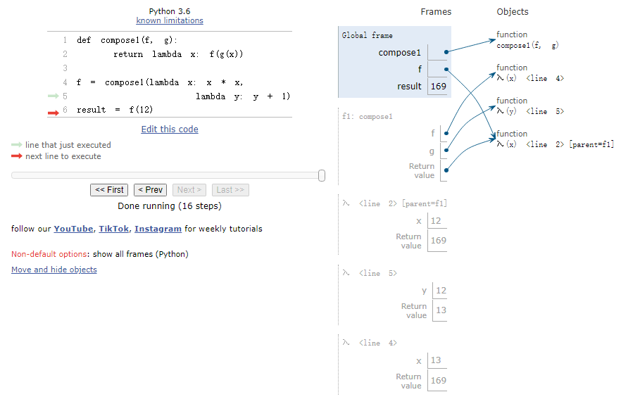

# Chapter 2: Building Abstractions with Data
## 2.1   Introduction
### 2.1.1   Native Data Types
* Every value in Python has a `class` that determines what type of value it is.
* Python includes three native numeric types: integers (`int`), real numbers (`float`), and complex numbers (`complex`).
```python
>>> type(2)
<class 'int'>
>>> type(1.5)
<class 'float'>
>>> type(1+1j)
<class 'complex'>

>>> type(1/3)
<class 'float'>
>>> 1/3
0.3333333333333333
>>> 1/3 == 0.333333333333333312345  # Beware of float approximation
True
```
## 2.2   Data Abstraction
### 2.2.1   Example: Rational Numbers
```python
>>> def add_rationals(x, y):
        nx, dx = numer(x), denom(x)
        ny, dy = numer(y), denom(y)
        return rational(nx * dy + ny * dx, dx * dy)
>>> def mul_rationals(x, y):
        return rational(numer(x) * numer(y), denom(x) * denom(y))
>>> def print_rational(x):
        print(numer(x), '/', denom(x))
>>> def rationals_are_equal(x, y):
        return numer(x) * denom(y) == numer(y) * denom(x)
```
### 2.2.2 Pairs
* Python provides a compound structure called a `list`, which can be constructed by placing expressions within square brackets separated by commas. 
```python
>>> pair = [10, 20]
>>> pair
[10, 20]
>>> x, y = pair
>>> x
10
>>> y
20
>>> pair[0]
10
>>> pair[1]
20
>>> getitem(pair, 0)
10
>>> getitem(pair, 1)
20
# 负索引从列表末尾开始计数，最右边元素的索引是-1
>>> pair[-1]
20
```
```python
>>> from fractions import gcd # 最大公约数
>>> def rational(n, d):
        g = gcd(n, d)
        return (n//g, d//g)
>>> def numer(x):
        return x[0]
>>> def denom(x):
        return x[1]
```
### 2.2.3   Abstraction Barriers
### 2.2.4   The Properties of Data
## 2.3 Sequences
* Sequences are not instances of a particular built-in type or abstract data representation, but instead a collection of behaviors that are shared among several different types of data. That is, there are many kinds of sequences, but they all share common behavior.
	* Length. A sequence has a finite length. An empty sequence has length 0.
	* Element selection. A sequence has an element corresponding to any non-negative integer index less than its length, starting at 0 for the first element.
### 2.3.1 Lists
```python
>>> digits = [1, 8, 2, 8]
>>> len(digits)
4
```
* For sequences, addition and multiplication do not add or multiply elements, but instead combine and replicate the sequences themselves.
```python
>>> [2, 7] + digits * 2
[2, 7, 1, 8, 2, 8, 1, 8, 2, 8]
```
* Any values can be included in a list, including another list.
```python
>>> pairs = [[10, 20], [30, 40]]
>>> pairs[1]
[30, 40]
>>> pairs[1][0]
30
```
### 2.3.2 Sequence Iteration
```python
>>> def count(s, value):
        """Count the number of occurrences of value in sequence s."""
        total = 0
        for elem in s:
            if elem == value:
                total = total + 1
        return total

>>> pairs = [[1, 2], [2, 2], [2, 3], [4, 4]]
>>> same_count = 0
>>>> for x, y in pairs:
        if x == y:
            same_count = same_count + 1
```
```python
for <name> in <expression>:
    <suite>
```
* A `for` statement is executed by the following procedure:
	* Evaluate the header `<expression>`, which must yield an iterable value.
	* For each element value in that iterable value, in order:
		* Bind `<name>` to that value in the current frame.
		* Execute the `<suite>`.
* A range is a sequence of consecutive integers(连续整数的序列).
* range is sequence but not list.
```python
>>> range(1, 10)  # Includes 1, but not 10
range(1, 10)
>>> list(range(5, 8))
[5, 6, 7]
>>> list(range(4))
[0, 1, 2, 3]

# This underscore is just another name in the environment as far as the interpreter is concerned, but has a conventional meaning among programmers that indicates the name will not appear in any future expressions.
>>> for _ in range(3):
        print('Go Bears!')

Go Bears!
Go Bears!
Go Bears!

# 构造嵌套lists
lists = [[] for _ in range(3)]
```
### 2.3.3 Sequence Processing
* List Comprehensions(列表推导式)
	*  `[<map expression> for <name> in <sequence expression> if <filter expression>]`
	* To evaluate a list comprehension, Python evaluates the `<sequence expression>`, which must return an iterable value. Then, for each element in order, the element value is bound to `<name>`, the filter expression is evaluated, and if it yields a true value, the map expression is evaluated. The values of the map expression are collected into a list.
```python
>>> odds = [1, 3, 5, 7, 9]
>>> [x+1 for x in odds]
[2, 4, 6, 8, 10]

>>> [x for x in odds if 25 % x == 0]
[1, 5]

>>> [[1] + s for s in [[4], [5, 6]]]
[[1, 4], [1, 5, 6]]
```
### 2.3.4   Sequence Abstraction
```python
>>> digits
[1, 8, 2, 8]
>>> 2 in digits
True
>>> 1828 not in digits
True
```
```python
>>> digits[0:2]
[1, 8]
>>> digits[1:]
[8, 2, 8]
>> digits[:2]
[1, 8]
>> digits[:]
[1, 8, 2, 8]
```
* `sum(iterable[, start]) -> value`
	* Return the sum of an iterable of numbers plus the calue of parameter 'start' (which defaults to 0). When the iterable is empty, return start. 	
```python
>>> sum([2, 3, 4])
9
>>> sum([2, 3, 4], 5)
14
>>> sum([[2, 3], [4]], [])
[2, 3, 4]

>>> sum([[1], [2, 3], [4]], [])
[1, 2, 3, 4]
>>> sum([[1]], [])
[1]
>>> sum([[[1]], [2]], [])
[[1], 2]
```
* `max(iterable[, key=func]) -> value` `max(a, b, c, ...[, key=func]) -> value`
	* With a single iterable argument, return its largest item.
	* With two or more arguments, return the largest argument.
```python
>>> max(range(5))
4
>>> max(0, 1, 2, 3, 4)
4
>>> max(range(10), key=lambda x: 7-(x-4)*(x-2))
3
```
* `all(iterable) -> bool`
	* Return True if bool(x) is True for all values in the iterable. If the iterable is empty, return True
```python
>>> all([x < 5 for x in range(5)])
True
>>> all(range(5))
False  
```
```python
nums = [5, 2, 1, 4, 1]  # 两个1
min_index = nums.index(min(nums))  # 返回第一个1的位置：2
```
### 2.3.5 Strings
* Python does not have a separate character type; any text is a string, and strings that represent single characters have a length of 1.
* Strings aren't limited to a single line. Triple quotes delimit string literals that span multiple lines.
```python
>>> city = 'Berkeley'
>>> len(city)
8
# an element of a string is itself a string, but with only one element
>>> city[3]
'k'

>>> 'Berkeley' + ', CA'
'Berkeley, CA'
>>> 'Shabu ' * 2
'Shabu Shabu '

# 寻找子字符串
>>> 'here' in "Where's Waldo?"
True

>>> """The Zen of Python
claims, Readability counts.
Read more: import this."""
'The Zen of Python\nclaims, "Readability counts."\nRead more: import this.'

>>> str(2) + ' is an element of ' + str(digits)
'2 is an element of [1, 8, 2, 8]'
```
```python
>>> 'curry = lambda f: lambda x: lambda y: f(x, y)'
'curry = lambda f: lambda x: lambda y: f(x, y)'
>>> exec('curry = lambda f: lambda x: lambda y: f(x, y)')
>>> curry
<function <lambda> at 0x1003c1bf8>
>>> curry(add)(3)(4)
7
```
```python
>>> a = 'A'
>>> ord(a)
65
>>> hex(ord(a))
'0x41'

>>> from unicodedata import name, lookup
>>> name('A')
'LATIN CAPITAL LETTER A'
>>> name('a')
'LATIN SMALL LETTER A'
>>> lookup('LATIN CAPITAL LETTER A')
'A'
>>> lookup('LATIN CAPITAL LETTER A').encode()
b'A'
>>> lookup('BABY').encode()
b'\xf0\x9f\x91\xb6'
```
### 2.3.6 Trees
* A tree has a root label and a list of branches
* Each branch is a tree

```python
# 树的构造函数
def tree(root_label, branches=[]):
     for branch in branches:
         assert is_tree(branch), 'branches must be trees'  # 验证每个分支是否为合法树
     return [root_label] + list(branches)  # 组合根标签与分支列表

# 返回根节点
def label(tree):
    return tree[0]  # 列表首元素即根标签

# 返回所有子树
def branches(tree):
    return tree[1:]  # 列表除首元素外的剩余部分

def is_tree(tree):
	if type(tree) != list or len(tree) < 1:
	    return False
	for branch in branches(tree):
	    if not is_tree(branch):
	        return False
	return True

def is_leaf(tree):
	return not branches(tree)

def fib_tree(n):
	 if n == 0 or n == 1:
	     return tree(n)
	 else:
	     left, right = fib_tree(n-2), fib_tree(n-1)
	     fib_n = label(left) + label(right)
	     return tree(fib_n, [left, right])

def count_leaves(tree):
	if is_leaf(tree):
	     return 1
	 else:
	     branch_counts = [count_leaves(b) for b in branches(tree)]
	     return sum(branch_counts)

def leaves(t):
	"""Return a list containing the leaf labels of tree."""
	if is_leaf(t):
		return [label(t)]
	return sum([leaves(b) for b in branches(t)], [])

def increment_leaves(t):
	"""Return a tree like t but with leaf labels incremented."""
	if is_leaf(t):
		return tree(label(t) + 1)
	else:
		bs = [increment_leaves(b) for b in branches(t)]
		return tree(label(t), bs)

def increment(t):
	"""Return a tree like t but with all labels incremented."""
	return tree(label(t) + 1, [increment(b) for b in branches(t)])

def print_tree(t, indent=0):
	print(' ' * indent + str(label(t)))
	for b in branches(t):
		print_tree(b, indent + 1)

def print_sums(t, so_far):
	if is_leaf(t):
		print(so_far + label(t))
	return [print_sums(b, so_far + label(t)) for b in branches(t)]
	
def count_paths(t, total):
	"""Return the number of paths from the root to any node in tree t for which the labels along the path sum to total."""
	if total - label(t) == 0:
		found = 1
	else:
		found = 0
	return found + sum([count_paths(b, total - label(t)) for b in branches(b)])
```
### 2.3.7   Linked Lists

```python
>>> empty = 'empty'
>>> def is_link(s):
        """s is a linked list if it is empty or a (first, rest) pair."""
        return s == empty or (len(s) == 2 and is_link(s[1]))
>>> def link(first, rest):
        """Construct a linked list from its first element and the rest."""
        assert is_link(rest), "rest must be a linked list."
        return [first, rest]
>>> def first(s):
        """Return the first element of a linked list s."""
        assert is_link(s), "first only applies to linked lists."
        assert s != empty, "empty linked list has no first element."
        return s[0]
>>> def rest(s):
        """Return the rest of the elements of a linked list s."""
        assert is_link(s), "rest only applies to linked lists."
        assert s != empty, "empty linked list has no rest."
        return s[1]
>>> def len_link(s):
        """Return the length of linked list s."""
        length = 0
        while s != empty:
            s, length = rest(s), length + 1
        return length
>>> def getitem_link(s, i):
        """Return the element at index i of linked list s."""
        while i > 0:
            s, i = rest(s), i - 1
        return first(s)
>>> def len_link_recursive(s):
        """Return the length of a linked list s."""
        if s == empty:
            return 0
        return 1 + len_link_recursive(rest(s))
>>> def getitem_link_recursive(s, i):
        """Return the element at index i of linked list s."""
        if i == 0:
            return first(s)
        return getitem_link_recursive(rest(s), i - 1)
```
## 2.4   Mutable Data
### 2.4.1   The Object Metaphor(隐喻)
### 2.4.2   Sequence Objects
* `list` is mutable(可变的) object.
* With mutable data, methods called on one name can affect another name at the same time.
```python
>>> chinese = ['coin', 'string', 'myriad']  # A list literal
>>> suits = chinese                         # Two names refer to the same list
>>> suits.pop()             # Remove and return the final element
'myriad'
>>> suits.remove('string')  # Remove the first element that equals the argument
>>> suits.append('cup')              # Add an element to the end
>>> suits.extend(['sword', 'club'])  # Add all elements of a sequence to the end
>>> suits[2] = 'spade'  # Replace an element
>>> suits
['coin', 'cup', 'spade', 'club']
>>> suits[0:2] = ['heart', 'diamond']  # Replace a slice
>>> suits
['heart', 'diamond', 'spade', 'club']
>>> chinese  # This name co-refers with "suits" to the same changing list
['heart', 'diamond', 'spade', 'club']
 
>>> nest = list(suits)  # Bind "nest" to a second list with the same elements
>>> nest[0] = suits     # Create a nested list
>>> suits.insert(2, 'Joker')  # Insert an element at index 2, shifting the rest
>>> nest
[['heart', 'diamond', 'Joker', 'spade', 'club'], 'diamond', 'spade', 'club']
>>> nest[0].pop(2)
'Joker'
>>> suits
['heart', 'diamond', 'spade', 'club']

# 判断两列表是否指向同一元素
>>> suits is nest[0]
True
>>> suits is ['heart', 'diamond', 'spade', 'club']
False
# 判断两列表是否相等
>>> suits == ['heart', 'diamond', 'spade', 'club']
True
```
```python
def f(s=[]):
	s.append(5)
	return len(s)
f() # 1
f() # 2
f() # 3
```
* `tuple`, is an immutable(不变的) sequence.
```python
>>> 1, 2 + 3
(1, 5)
>>> ("the", 1, ("and", "only"))
('the', 1, ('and', 'only'))
>>> type( (10, 20) )
<class 'tuple'>
>>> ()    # 0 elements
()
>>> (10,) # 1 element
(10,)

>>> code = ("up", "up", "down", "down") + ("left", "right") * 2
>>> len(code)
8
>>> code[3]
'down'
>>> code.count("down")
2
>>> code.index("left")
4
```
```python
>>> s = ([1, 2], 3)
>>> s[0] = 4
ERROR
>>> s[0][0] = 4
>>> s
([4, 2], 3)
```
### 2.4.3   Dictionaries
* Dictionary keys do have two restrictions:
	* A key of a dictionary cannot be a list or a dictionary (or any mutable type)
	* Two keys cannot be equal; There can be at most one value for a given key
* `{<key exp>: <value exp> for <name> in <iter exp> if <filter exp>}`
```python
>>> numerals = {'I': 1.0, 'V': 5, 'X': 10}
>>> numerals['X']
10
>>> list(numerals)
['I', 'V', 'X']
>>> numerals.values()
dict_values([1, 5, 10])
>>> list(numerals.values())
[1, 5, 10]

>>> numerals['I'] = 1
>>> numerals['L'] = 50
>>> numerals
{'I': 1, 'X': 10, 'L': 50, 'V': 5}

>>> sum(numerals.values())
66

>>> dict([(3, 9), (4, 16), (5, 25)])
{3: 9, 4: 16, 5: 25}

# The arguments to get are the key and the default value.
>>> numerals.get('A', 0)
0
>>> numerals.get('V', 0)
5
>>> numerals.pop('X')
```
```python
.keys()
.values()
.items()
# 可以使用 in 关键字来检查字典中是否包含某个键：
```
### 2.4.4   Local State
### 2.4.5   The Benefits of Non-Local Assignment
```python
def make_withdraw(balance):
	def withdraw(amount):
		nonlocal balance
		if amount > balance:
			return 'Insufficient funds'
		balance = balance - amount
		return balance
	return withdraw

wd = make_withdraw(20)
wd2 = make_withdraw(7)
# 修改各自的balance
wd2(6) # balance = 1
wd(8) # balance = 12
```
### 2.4.6   The Cost of Non-Local Assignment
### 2.4.7   Implementing Lists and Dictionaries
```python
>>> def mutable_link():
        """Return a functional implementation of a mutable linked list."""
        contents = empty
        def dispatch(message, value=None):
            nonlocal contents
            if message == 'len':
                return len_link(contents)
            elif message == 'getitem':
                return getitem_link(contents, value)
            elif message == 'push_first':
                contents = link(value, contents)
            elif message == 'pop_first':
                f = first(contents)
                contents = rest(contents)
                return f
            elif message == 'str':
                return join_link(contents, ", ")
        return dispatch

>>> def to_mutable_link(source):
        """Return a functional list with the same contents as source."""
        s = mutable_link()
        for element in reversed(source):
            s('push_first', element)
        return s

>>> def dictionary():
        """Return a functional implementation of a dictionary."""
        records = []
        def getitem(key):
            matches = [r for r in records if r[0] == key]
            if len(matches) == 1:
                key, value = matches[0]
                return value
        def setitem(key, value):
            nonlocal records
            non_matches = [r for r in records if r[0] != key]
            records = non_matches + [[key, value]]
        def dispatch(message, key=None, value=None):
            if message == 'getitem':
                return getitem(key)
            elif message == 'setitem':
                setitem(key, value)
        return dispatch
```
### 2.4.8   Dispatch Dictionaries
### 2.4.9   Propagating Constraints(传播约束）
* 基于约束传播的系统，用于摄氏度和华氏度之间的双向转换。核心思想是通过连接器（connectors）和约束（constraints）构建一个网络，当任一节点的值发生变化时，变化会自动传播到相关节点。

```python
>>> celsius = connector('Celsius')
>>> fahrenheit = connector('Fahrenheit')
>>> def converter(c, f):
        """Connect c to f with constraints to convert from Celsius to Fahrenheit."""
        u, v, w, x, y = [connector() for _ in range(5)]
        multiplier(c, w, u)
        multiplier(v, x, u)
        adder(v, y, f)
        constant(w, 9)
        constant(x, 5)
        constant(y, 32)

>>> converter(celsius, fahrenheit)

>>> celsius['set_val']('user', 25)
Celsius = 25
Fahrenheit = 77.0
>>> fahrenheit['set_val']('user', 212)
Contradiction detected: 77.0 vs 212
>>> celsius['forget']('user')
Celsius is forgotten
Fahrenheit is forgotten
>>> fahrenheit['set_val']('user', 212)
Fahrenheit = 212
Celsius = 100.0
```
* `connector['set_val'](source, value)` indicates that the `source` is requesting the connector to set its current value to `value`.
* `connector['has_val']()` returns whether the connector already has a value.
* `connector['val']` is the current value of the connector.
* `connector['forget'](source)` tells the connector that the `source` is requesting it to forget its value.
* `connector['connect'](source)` tells the connector to participate in a new constraint, the `source`.
* `constraint['new_val']()` indicates that some connector that is connected to the constraint has a new value.
* `constraint['forget']()` indicates that some connector that is connected to the constraint has forgotten its value.
```python
>>> from operator import mul, truediv
>>> def multiplier(a, b, c):
        """The constraint that a * b = c."""
        return make_ternary_constraint(a, b, c, mul, truediv, truediv)

>>> def constant(connector, value):
        """The constraint that connector = value."""
        constraint = {}
        connector['set_val'](constraint, value)
        return constraint

>>> def connector(name=None):
        """A connector between constraints."""
        informant = None
        constraints = []
        def set_value(source, value):
            nonlocal informant
            val = connector['val']
            if val is None:
                informant, connector['val'] = source, value
                if name is not None:
                    print(name, '=', value)
                inform_all_except(source, 'new_val', constraints)
            else:
                if val != value:
                    print('Contradiction detected:', val, 'vs', value)
        def forget_value(source):
            nonlocal informant
            if informant == source:
                informant, connector['val'] = None, None
                if name is not None:
                    print(name, 'is forgotten')
                inform_all_except(source, 'forget', constraints)
        connector = {'val': None,
                     'set_val': set_value,
                     'forget': forget_value,
                     'has_val': lambda: connector['val'] is not None,
                     'connect': lambda source: constraints.append(source)}
        return connector

>>> def inform_all_except(source, message, constraints):
        """Inform all constraints of the message, except source."""
        for c in constraints:
            if c != source:
                c[message]()
```