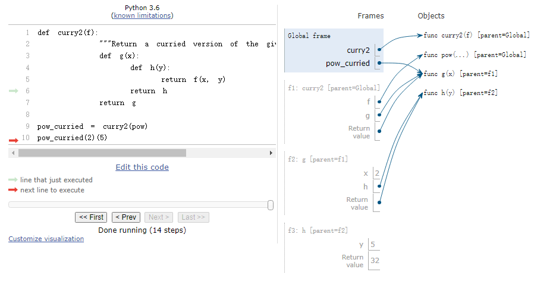

# Lecture 23 Efficiency
```python
>>> def fib(n):
        if n == 0:
            return 0
        elif n == 1:
            return 1
        else:
            return fib(n - 2) + fib(n - 1)
>>> fib(5)
5

# 调用次数
>>> def count(f):
        def counted(n):
            counted.call_count += 1
            return f(n)
        counted.call_count = 0
        return counted
>>> fib = count(fib)
>>> fib(19)
4181
>>> fib.call_count
10946

# max_count 属性是 open_count 曾经达到的最大值，它对应于在计算过程中同时处于活动状态的最大帧数
>>> def count_frames(f):
        def counted(n):
            counted.open_count += 1
            counted.max_count = max(counted.max_count, counted.open_count)
            result = f(n)
            counted.open_count -= 1
            return result
        counted.open_count = 0
        counted.max_count = 0
        return counted
>>> fib = count_frames(fib)
>>> fib(19)
4181
>>> fib.open_count
0
>>> fib.max_count
19
>>> fib(24)
46368
>>> fib.max_count
24
```
```python
# 记忆化
>>> def memo(f):
        cache = {}
        def memorized(n):
            if n not in cache:
                cache[n] = f(n)
            return cache[n]
        return memorized

>>> counted_fib = count(fib)
>>> fib =memo(count_fib)
>>> fib(19)
4181
>>> counted_fib.call_count
20
>>> fib(34)
5702887
>>> counted_fib.call_count
35
```
