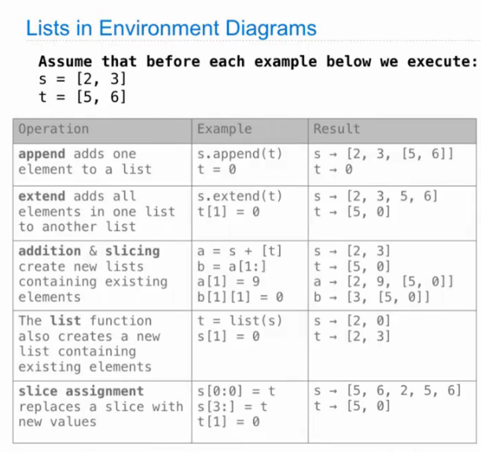
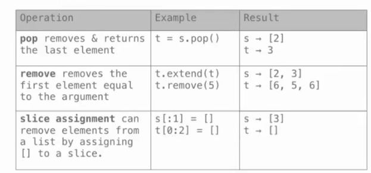
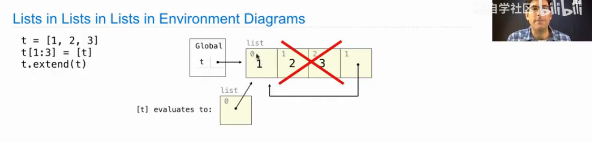
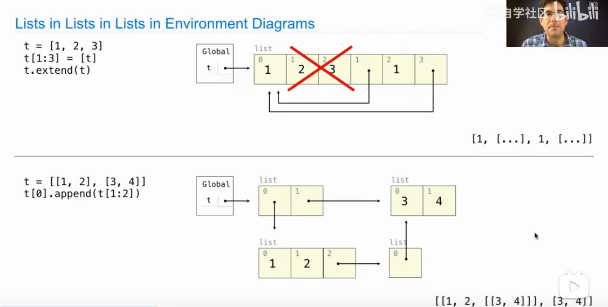
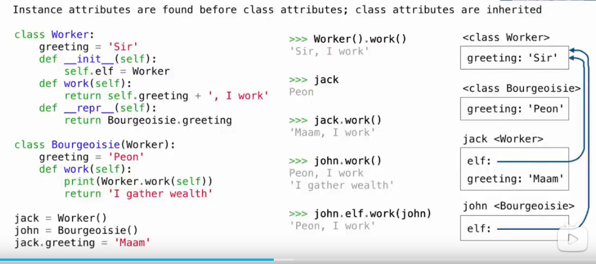

# Lecture 25 Data Examples
* Lists in Environment Diagrams




* Objects

* Iterables & Iterators
```python
def min_abs_indices(s):
    min_abs = min(map(abs, s))
    return [i for i in range(len(s)) if abs(s[i]) == min_abs]

def largest_adj_sum(s):
    """Largest sum of two adjacent elements in a list of s."""
    return max(s[i] + s[i + 1] for i in range(len(s) - 1))
    # 法二
    return max([a + b for a, b in zip(s[:-1], s[1:])])

def digit_dict(s):
    """Map each digit d to the lists of elements in s that end with d."""
    last_digit = [x % 10 for x in s]
    return {d: [x for x in s if x % 10 == d] for d in range(10) if d in last_digit}

def all_have_an_equal(s):
    """Does every element equal some other element in s?"""
    return all([s[i] in s[:i] + s[i+1:] for i in range(len(s))])
    # 法二
    return min([s.count(x) for x in s]) > 1
```
* Linked List
```python
def ordered(s, key=lambda x: x):
    """Is Link s ordered?"""
    if s is Link.empty or s.rest is Link.empty:
        return True
    elif key(s.first) > key(s.rest.first):
        return False
    else:
        return ordered(s.rest, key)

def merge(s, t):
    """Return a sorted Link with the elements of sorted s & t."""
    if s is Link.empty:
        return t
    elif t is Link.empty:
        return s
    elif s.first <= t.first:
        return Link(s.first, merge(s.rest, t))
    else:
        return Link(t.first, merge(s, t.rest))

def merge_in_place(s, t):
    """Return a sorted Link with the elements of sorted s & t.

    >>> a = Link(1, Link(5))
    >>> b = Link(1, Link(4))
    >>> merge_in_place(a, b)
    Link(1, Link(1, Link(4, 5)))
    >>> a
    Link(1, Link(1, Link(4, 5)))
    >>> b
    Link(1, Link(4, Link(5)))
    """
    if s is Link.empty:
        return t
    elif t is Link.empty:
        return s
    elif s.first <= t.first:
        s.rest = merge_in_place(s.rest, t)
        return s
    else:
        t.rest merge_in_place(t.rest, s)
        return t
```