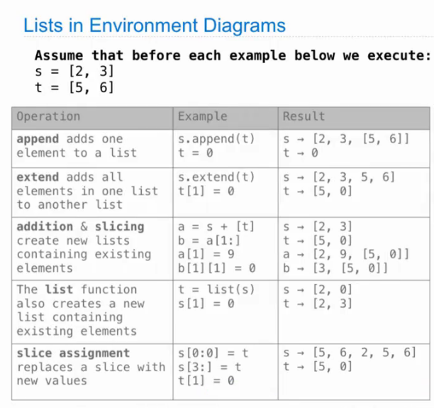
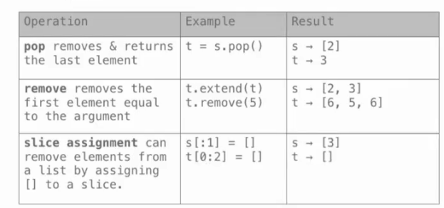
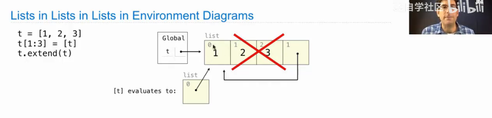
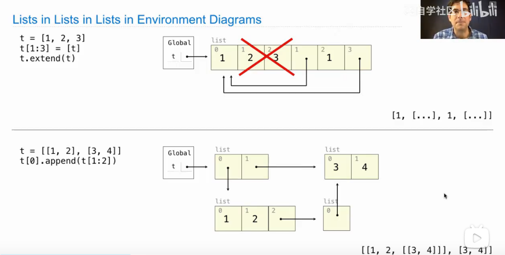
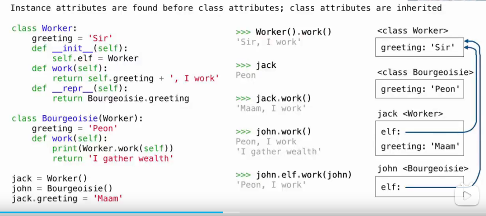

# Lecture 25 Data Examples
* Lists in Environment Diagrams




* Objects

* Iterables & Iterators
```python
def min_abs_indices(s):
    min_abs = min(map(abs, s))
    return [i for i in range(len(s)) if abs(s[i]) == min_abs]

def largest_adj_sum(s):
    """Largest sum of two adjacent elements in a list of s."""
    return max(s[i] + s[i + 1] for i in range(len(s) - 1))
    # 法二
    return max([a + b for a, b in zip(s[:-1], s[1:])])

def digit_dict(s):
    """Map each digit d to the lists of elements in s that end with d."""
    last_digit = [x % 10 for x in s]
    return {d: [x for x in s if x % 10 == d] for d in range(10) if d in last_digit}

def all_have_an_equal(s):
    """Does every element equal some other element in s?"""
    return all([s[i] in s[:i] + s[i+1:] for i in range(len(s))])
    # 法二
    return min([s.count(x) for x in s]) > 1
```
* Linked List
```python
def ordered(s, key=lambda x: x):
    """Is Link s ordered?"""
    if s is Link.empty or s.rest is Link.empty:
        return True
    elif key(s.first) > key(s.rest.first):
        return False
    else:
        return ordered(s.rest, key)

def merge(s, t):
    """Return a sorted Link with the elements of sorted s & t."""
    if s is Link.empty:
        return t
    elif t is Link.empty:
        return s
    elif s.first <= t.first:
        return Link(s.first, merge(s.rest, t))
    else:
        return Link(t.first, merge(s, t.rest))

def merge_in_place(s, t):
    """Return a sorted Link with the elements of sorted s & t.

    >>> a = Link(1, Link(5))
    >>> b = Link(1, Link(4))
    >>> merge_in_place(a, b)
    Link(1, Link(1, Link(4, 5)))
    >>> a
    Link(1, Link(1, Link(4, 5)))
    >>> b
    Link(1, Link(4, Link(5)))
    """
    if s is Link.empty:
        return t
    elif t is Link.empty:
        return s
    elif s.first <= t.first:
        s.rest = merge_in_place(s.rest, t)
        return s
    else:
        t.rest merge_in_place(t.rest, s)
        return t
```
## 集合
* 集合（set），集合字面量遵循了它的数学表示法：用大括号括起来元素们。
* 重复的元素会在创建集合时被移除。
* 集合是无序的，这表明元素被打印的顺序可能和他们在字面量中的顺序不同。
```python
>>> s = {3, 2, 1, 4, 4}
>>> s
{1, 2, 3, 4}

>>> 3 in s
True
>>> len(s)
4
# 并集
>>> s.union({1, 5})
{1, 2, 3, 4, 5}
# 交集
>>> s.intersection({6, 5, 4, 3})
{3, 4}
```
```python
# isdisjoint 判断两个集合是否没有交集
a = {1, 2, 3}
b = {4, 5}
c = {3, 4}
print(a.disjoint(b)) # True，没有交集
print(a.disjoint(c)) # False，有交集 3
```
```python
# issubset 判断当前集合是否是另一个集合的子集
a = {1, 2}
b = {1, 2, 3}
print(a.issubset(b)) # True, a是b的子集
print(b.issubset(a)) # False, b不是a的子集
```
```python
# issuperset 判断当前集合是否是另一个集合的超集
a = {1, 2, 3}
b = {1, 2}
print(a.issubset(b)) # True, a包含b
print(b.issubset(a)) # False, b不包含a
```
```python
s = {1, 2}
# 添加元素
s.add(3)
print(s) # {1, 2, 3}

# 删除元素
s.remove(2)
print(s) # {1, 3}
# s.remove(5) # 报错, keyError

# 删除元素
s = {1, 2, 3}
s.discard(2)
print(s) # {1, 3}
s.discard(5) # 不报错
print(s) # {1, 3}

# 随机删除一个元素
s = {1, 2, 3}
elem = s.pop()
print(elem) # 随机返回一个元素，比如1
print(s) # 剩下的集合

# 清空集合
s = {1, 2, 3}
s.clear()
print(s) # set()

# 将另一个集合或可迭代对象的元素添加到当前集合
s = {1, 2}
s.update({2, 3, 4})
print(s) # {1, 2, 3, 4}
```
* 实现无序序列集合
```python
>>> def empty(s):
        return s is Link.empty
>>> def set_contains(s, v):
        """当且仅当 set s 包含 v 时返回 True。"""
        if empty(s):
            return False
        elif s.first == v:
            return True
        else:
            return set_contains(s.rest, v)
>>> s = Link(4, Link(1, Link(5)))
>>> set_contains(s, 2)
False
>>> set_contains(s, 5)
True

>>> def adjoin_set(s, v):
        """返回一个包含 s 的所有元素和元素 v 的所有元素的集合。"""
        if set_contains(s, v):
            return s
        else:
            return Link(v, s)
>>> t = adjoin_set(s, 2)
>>> t
Link(2, Link(4, Link(1, Link(5))))

>>> def intersect_set(set1, set2):
        """返回一个集合，包含 set1 和 set2 中的公共元素。"""
        return keep_if_link(set1, lambda v: set_contains(set2, v))
>>> intersect_set(t, apply_to_all_link(s, square))
Link(4, Link(1))

>>> def union_set(set1, set2):
        """返回一个集合，包含 set1 和 set2 中的所有元素。"""
        set1_not_set2 = keep_if_link(set1, lambda v: not set_contains(set2, v))
        return extend_link(set1_not_set2, set2)
>>> union_set(t, s)
Link(2, Link(4, Link(1, Link(5))))
```
* 实现有序序列集合
```python
>>> def set_contains(s, v):
        if empty(s) or s.first > v:
            return False
        elif s.first == v:
            return True
        else:
            return set_contains(s.rest, v)
>>> u = Link(1, Link(4, Link(5)))
>>> set_contains(u, 0)
False
>>> set_contains(u, 4)
True

>>> def intersect_set(set1, set2):
        if empty(set1) or empty(set2):
            return Link.empty
        else:
            e1, e2 = set1.first, set2.first
            if e1 == e2:
                return Link(e1, intersect_set(set1.rest, set2.rest))
            elif e1 < e2:
                return intersect_set(set1.rest, set2)
            elif e2 < e1:
                return intersect_set(set1, set2.rest)
>>> intersect_set(s, s.rest)
Link(4, Link(5))
```
```python
>>> def set_contains(s, v):
        if s is None:
            return False
        elif s.entry == v:
            return True
        elif s.entry < v:
            return set_contains(s.right, v)
        elif s.entry > v:
            return set_contains(s.left, v)

>>> def adjoin_set(s, v):
        if s is None:
            return Tree(v)
        elif s.entry == v:
            return s
        elif s.entry < v:
            return Tree(s.entry, s.left, adjoin_set(s.right, v))
        elif s.entry > v:
            return Tree(s.entry, adjoin_set(s.left, v), s.right)
>>> adjoin_set(adjoin_set(adjoin_set(None, 2), 3), 1)
Tree(2, Tree(1), Tree(3))
```