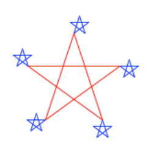
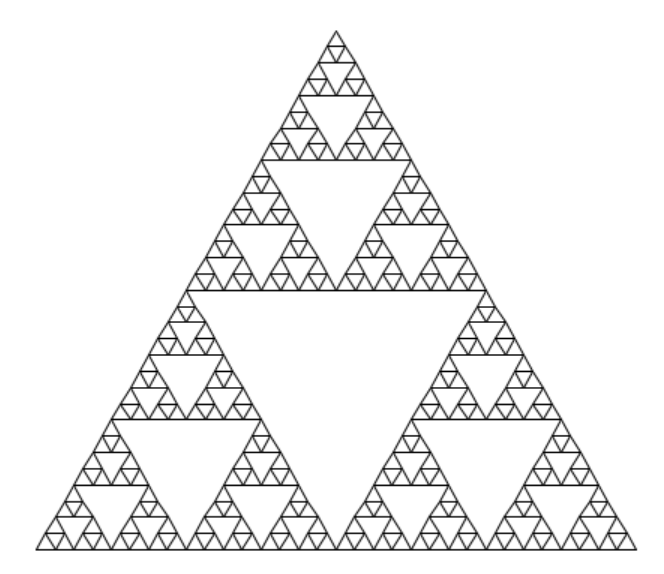

# Lecture 28 Scheme
* Scheme 是 Lisp 的一个变种，而 Lisp 是继 Fortran 之后仍然广受欢迎的第二古老的编程语言。
## 表达式
* Scheme 程序主要是由各种表达式构成的，这些表达式可以是函数调用或一些特殊的结构。一个函数调用通常由一个操作符和其后面跟随的零个或多个操作数组成，这点和 Python 是相似的。不过在 Scheme 中，这些操作符和操作数都被放在一对括号里。
* Scheme 的语法一直采用前缀形式。也就是说，操作符像 + 和 * 都放在前面。函数调用可以互相嵌套，并且可能会写在多行上。
```scheme
scm> quotient      ; 绑定到内置过程的符号
#[quotient]
scm> +             ; 绑定到内置过程的符号
#[+]
```
```scheme
scm> (quotient 10 2)

scm> (+ (* 3 5) (- 10 6))

scm> (+ (* 3
        (+ (* 2 4)
            (+ 3 5)))
     (+ (- 10 7)
         6))

scm> (+)
0

scm> (*)
1

scm> (number? 3)
#t ; 真

scm> (number? +)
#f ; 假

scm> (zero? 0)
#t

scm> (integer? 2.2)
#f
``` 
* 在 Scheme 中，表达式可以是基础类型，如数字，或是复合类型，如函数调用。数字字面量是基础类型，而函数调用则是可以包含任意子表达式一种复合形式。当求值一个函数调用时，Scheme 的处理方式和 Python 相似：首先对操作符和操作数进行求值，然后用操作符的结果（即函数）去处理操作数的结果（即参数）。
```scheme
; If expression
(if <predicate> <consequent> <alternative>)

; and / or
(and <e1> ... <en>)
(or <e1> ... <en>)
(not <e>)
```
## 定义
```scheme
; Binding symbols
(define <symbol> <expression>)
> (define pi 3.14)
> (* pi 2)
6.28

; New procedures
(define (<name> <formal parameters>) <body>)
> (define (square x) (* x x))
> (square 21)
> (square (+ 2 5)) 
> (square (square 3))

> (define (average x y)
    (/ (+ x y) 2))
> (average 1 3)
2

> (define (abs x)
      (if (< x 0)
          (- x)
          x))
> (abs -3)
3
```
```scheme
> (define (sqrt x)
    (define (good-enough? guess)
      (< (abs (- (square guess) x)) 0.001))
    (define (improve guess)
      (average guess (/ x guess)))
    (define (sqrt-iter guess)
      (if (good-enough? guess)
          guess
          (sqrt-iter (improve guess))))
    (sqrt-iter 1.0))

> (sqrt 9)
```
```scheme
(lambda (<formal-parameters>) <body>)
(define (plus4 x) (+ x 4))
(define plus4 (lambda (x) (+ x 4)))

((lambda (x y z) (+ x y (square z))) 1 2 3)
```
## 复合类型
* The `cond` special form that behaves like `if-elif-else` statements in Python.
```python
# in python
if x > 10:
    print('big')
elif x > 5:
    print('medium')
else:
    print('small')
```
```scheme
(cond ((> x 10) (print 'big))
      ((> x 5)  (print 'medium))
      (else     (print 'small)))

(print
  (cond ((> x 10) 'big)
        ((> x 5)  medium)
        (else     'small)))
```
```python
(define (repeat f n) 
  (lambda (x)
    (if (= n 0)
        x
        (f ((repeat f (- n 1)) x)))))
```
* The `begin` special form combines multiple expressions into one expression.
```python
# in python
if x > 10:
    print('big')
    print('guy')
else:
    print('small')
    print('fry')
```
```scheme
(cond ((> x 10) (begin (print 'big) (print 'guy)))
      (else (begin (print 'small) (print 'fry))))

(if (> x 10) (begin
                (print 'big)
                (print 'guy))
             (begin
                (print 'small)
                (print 'fry)))
```
* The `let` special form binds symbols to values temporarily; just for one expression.
```python
# in python
a = 3
b = 2 + 2
c = math.sqrt(a * a + b * b)
# a and b are still bound down here
```
```scheme
(let ((变量1 值1)
      (变量2 值2)
      ...)
  表达式1
  表达式2
  ...)
(define c (let ((a 3)
                (b (+ 2 2)))
               (sqrt (+ (* a a) (* b b)))))
; a and b are not bound down here 
```
## 海龟图形
```scheme
; 重复fn函数k次
> (define (repeat k fn) (if (> k 0)
                            (begin (fn) (repeat (- k 1) fn))
                            nil))

; fd 向前移动
; rt 向右转
> (repeat 5
          (lambda () (fd 100)
                     (repeat 5
                             (lambda () (fd 20) (rt 144)))
                     (rt 144)))
nil
```

```scheme
> (define (repeat k fn)
    (if (> k 0)
        (begin (fn) (repeat (- k 1) fn))
        nil))

; tri 函数是一个通用方法，它可以将某个绘图操作重复三次，每次操作后，都会让乌龟左转。
> (define (tri fn)
    (repeat 3 (lambda () (fn) (lt 120))))

; sier 函数接受两个参数：一是长度 d，另一个是递归的深度 k。
; 如果深度为 1，向前画线；
; 否则，它会调用 leg 函数来构建一个由三个小三角形组成的大三角形。
> (define (sier d k)
    (tri (lambda ()
           (if (= k 1) (fd d) (leg d k)))))


; leg 函数的功能是画一个谢尔宾斯基三角形的边
; 它首先递归调用 sier 函数来画出边的上半部分
; 然后移动乌龟到下一个顶点
; 而 penup 和 pendown 函数的作用是控制乌龟的画笔，使其在移动时可以选择是否画线
> (define (leg d k)
    (sier (/ d 2) (- k 1))
    (penup)
    (fd d)
    (pendown))

```
