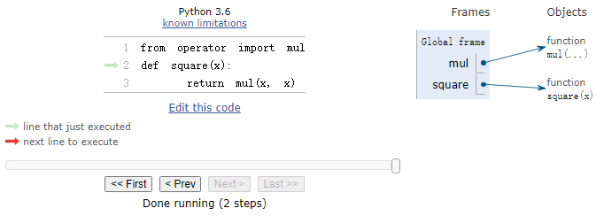

# Lecture 2 Functions
## python交互
* 浏览历史记录：`ctrl + p`上一个、`ctrl + n`下一个
* 清屏：`ctrl + l`
## 导入库函数
```python
>>> from math import sqrt
>>> sqrt(256)
16.0

from operator import add, sub, mul
```
## 名称与环境
* 赋值是最简单的抽象方法，因为它允许我们使用简单名称来指代复合操作的结果。
* 将名称与值绑定，之后通过名称检索可能得值，就意味着解释器必须维护某种内存来记录名称、值和绑定，这种内存就是环境。
* 名称也可以与函数绑定。
```python
>>> max
<built-in function max>

>>> f = max
>>> f
<built-in function max>
>>> f(2, 3, 4)
4

>>> f = 2
>>> f
2

>>> max = 5
>>> max
5
```
* 执行赋值语句时，Python会先求解`=`右侧的表达式，再将结果与左侧的名称绑定。

## 非纯函数`print`
* 纯函数：函数有一些输入（参数）并返回一些输出（调用返回结果）。
* 非纯函数：除了返回值外，调用一个非纯函数还会产生其他改变解释器和计算机的状态的副作用。一个常见的副作用就是`print`函数产生额外输出。
* The special value `None` represents nothing in Python.
* A function that does not explicitly return a value will return `None`
* `None` is not displayed by the interpreter as the value of an expression.
```python
# print返回的值始终为None
>>> print(print(1), print(2))
1
2
None None
```
```python
>>> two = print(2)
2
>>> print(two)
None
```
```python
>>> 'Go Bears!'
'Go Bears!'
>>> print('Go Bears!')
Go Bears!

>>> None
>>> print(None)
None

>>> print(1, 2, 3)
1 2 3
```
```python
>>> def does_not_square(x):
        x * x # no return
# None value is not displayed
>>> does_not_square(4)
# The name sixteen is now bound to the value None
>>> sixteen = does_not_square(4)
```
## 定义函数
* Function definition is a more powerful means of abstrction: binds names to expressions.
```python
def <name>(<formal parameters>):
    return <return expression>
```
```python
>>> def g():
        return 1
>>> g()
1
>>> g = 2
>>> g
2
>>> def g(h, i):
        return h + i
>>> g(1, 2)
3
```

* 函数签名：对函数形式参数的描述被称为函数的签名。函数`max`可以接受任意数量的参数，所以它被呈现为`max(...)`。
## 调用用户定义的函数


## 运算符
```python
>>> 5 / 4
1.25
>>> 8 / 4
2.0

>>> 5 // 4
1
>>> -5 // 4
-2

from operator import truediv, floordiv
>>> truediv(5, 4)
1.25
>>> floordiv(5, 4)
1
```