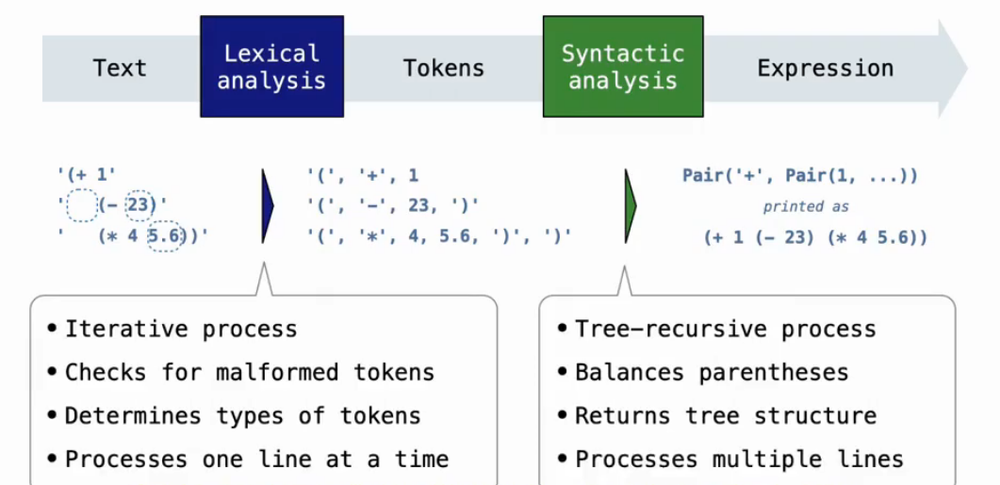

# Lecture 30 Calculator
## Exceptions
* Python 解释器在检测到表达式或语句中出现错误时会抛出异常。用户也可以使用 `raise` 和 `assert` 语句来抛出异常。
* 异常是一个对象实例，其类（class）直接或间接继承自 `BaseException` 类。
```python
>>> raise Exception(' An error occurred')
Traceback (most recent call last):
	File "<stdin>", line 1, in <module>
Exception: an error occurred
```
* 异常可以由封闭的 `try` 语句来处理。`try` 语句由多个子句组成；第一个以 `try` 开头，其余的以 `except` 开头。
```python
try:
	<try suite>
except <exception class> as <name>:
	<except suite>
```
```python
>>> try:
		x = 1 / 0:
	except ZeroDivisionError as e:
		print('handling a', type(e))
		x = 0
handling a <class 'ZeroDivisionError'>
>>> x
0
```
## Parsing
* A scheme list is written as elements in parentheses(括号).
```
(<element_0><element_1> ... <element_n>)
Each <element> can be a combination or primitive
```
* The task of parsing a language involves coercing a string representation of an expression to the expression itself(解析一种语言的任务涉及将表达式的字符串表示强制转换为表达式本身).
* A Parser takes text and returns an expression.

* Syntactic analysis identifies the hierarchical structure of an expression, which may be nested.
## Scheme-Syntax Calculator
```python
def calc_eval(exp):
    if type(exp) in (int, float):
        return simplify(exp)
    elif isinstance(exp, Pair):
        arguments = exp.second.map(calc_eval)
        return simplify(calc_apply(exp.first, arguments))
    else:
        raise TypeError

def calc_apply(operator, args):
    if not isinstance(operator, str):
        raise TypeError
    if operator == '+':
        return reduce(add, args, 0)
    elif operator == '-':
        if len(args) == 0:
            raise TypeError
        elif len(arge) == 1:
            return -args.first
        else:
            return reduce(sub, args.second, args.first)
    elif operator == '*':
        return reduce(mul, args, 1)
    elif operator == '/':
        if len(args) == 0:
            raise TypeError
        elif len(arge) == 1:
            return 1 / args.first
        else:
            return reduce(truediv, args.second, args.first)   
    else:
        raise TypeError 

def simplify(value):
    if isinstance(value, float) and int(value) == value:
        return int(value)
    return value

def reduce(fn, scheme_list, start):
    if scheme_list is nil:
        return start
    return reduce(fn, scheme_list.second, fn(start, scheme_list.first))

def as_scheme_list(*args):
    if len(args) == 0:
        return nil
    return Pair(args[0], as_scheme_list(*args[1:]))

def read_eval_print_loop():
    while True:
        try:
            src = buffer_input()
            while src.more_on_line:
                expression = scheme_read(src)
                print(calc_eval(expression))
        except (SyntaxError, TypeError, ValueError, ZeroDivisionError) as err:
            print(type(err).__name__ + ':', err)
        except (KeyboardInterrupt, EOFError):
            print('Calculation completed.')
            return
```