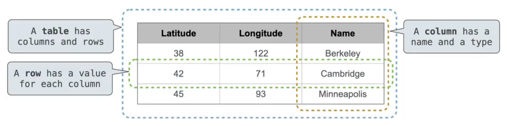
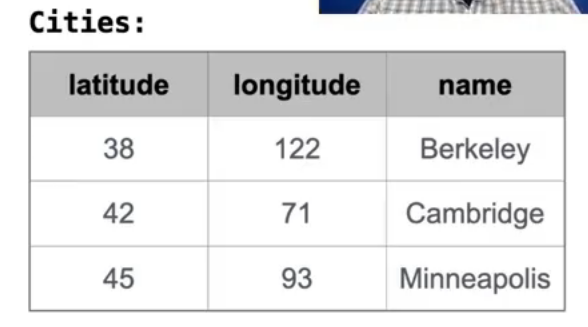
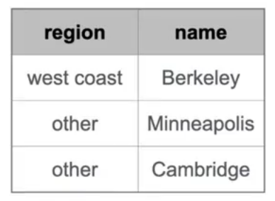
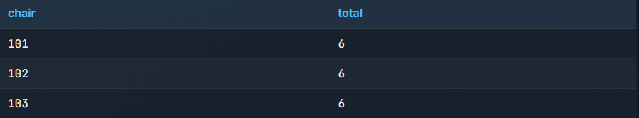

# Lecture 35 SQL
* A table is a collection of records, which are rows that have a value for each column/

* The Structured Query Language(SQL) is perhaps the most widely used programming language.
* SQL is a declarative programming language.
* A `select` statement always includes a comma-separated list of column descriptions
* A column description is an expression, optionally followed by `as` and a column name.
* Selecting literals creates a one-row table.
* The `union` of two select statements is a table containing the rows of both of their results.
* The result of a `select` statement is displayed to the user, but not stored.
* A `create table` statement gives the result a name.
```sql
create table [name] as [select statement];
select [expression] as [name], [expression] as [name];

create table cities as
    select 38 as latitude, 122 as longitude, "Berkeley" as name union
    select 42            , 71              , "Cambridge"        union
    select 45            , 93              , "Minneapolis";
```

* A `select` statement can specify an input table using a `from` clause.
* A subset of the rows of the input table can be selected using a `where` clause.
* An ordering over the remaining rows can be declared using an `order by` clause.
* Column descriptions determine how each input row is projected to a result row.
```sql
select [columns] from [table] where [condition] order by [order];
select "west coast" as region, name from cities where longtitude >= 115 union
select "other"               , name from cities where longtitude < 115;
```

```sql
create table lift as
    select 101 as chair, 2 as single, 2 as couple union
    select 102         , 0          , 3           union
    select 103         , 4          , 1;

select chair, single + 2 * couple as total from lift;
```
