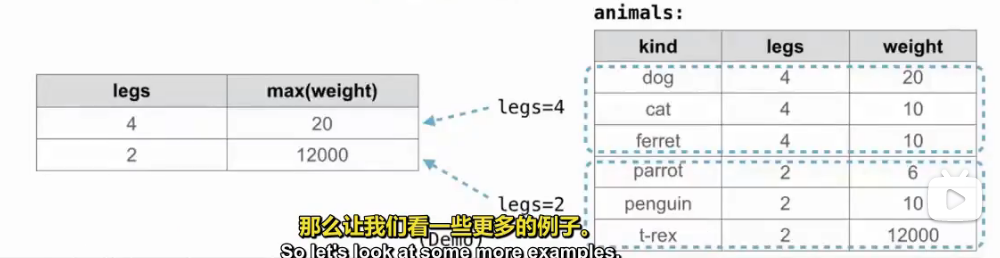

# Lecture 37 Aggregation
```sql
select max(legs) from animals;
sum()
avg()
min()
count()
count(*)
count(distinct legs)
```
* Rows in a table can be grouped, and aggregation is performed on each group.
```sql
select [columns] from [table] group by [expression] having [expression];

select legs, max(weight) from animals group by legs;
select weight/legs, count(*) from animals group by weight/legs having count(*) > 1;
```
