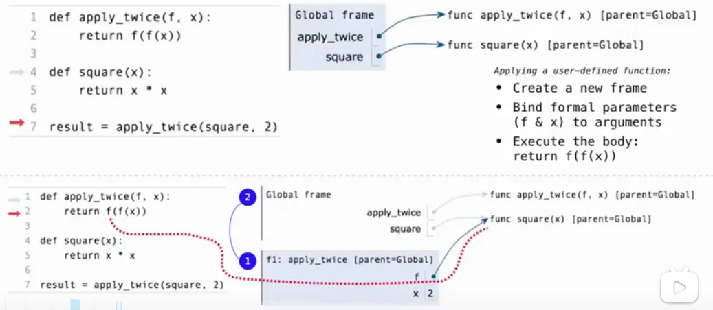
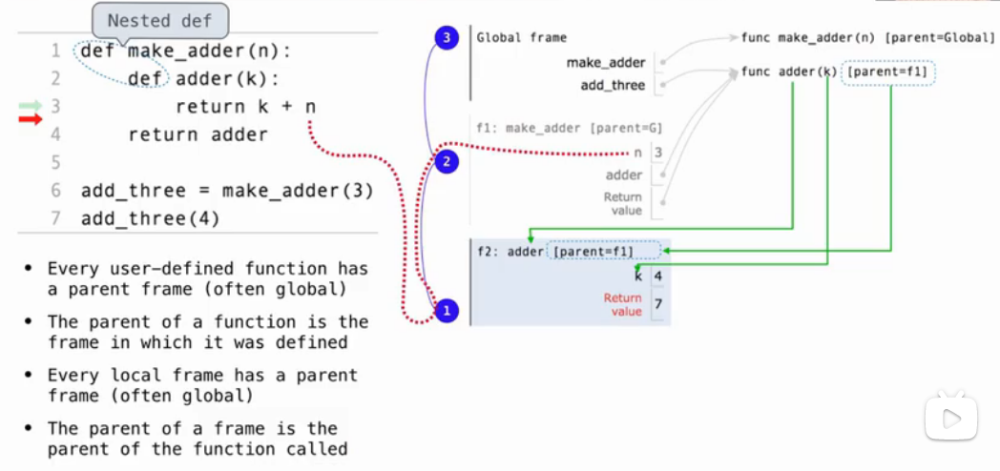

# Lecture 5 Environments



## Lambda表达式
* 我们可以使用lambda表达式临时创建函数，这些表达式会计算未命名的函数。一个lambda表达式的计算结果是一个函数，它仅有一个返回表达式作为主体。不允许使用赋值和控制语句。
```python
>>> def compose1(f, g):
        # A function that takes x and returns f(g(x))
        return lambda x: f(g(x))
```
* lambda表达式的结果称为lambda函数（匿名函数）。它没有固定名称（因此python打印`<lambda>`作为名称），但除此之外它的行为与任何其他函数都相同。


## Currying
* Currying: Transforming a multi-argument function into a single-argument, higher-order function.
```python
>>> def curry2(f):
        def g(x):
            def h(y):
                return f(x, y)
            return h
        return g

>>> from operator import add
>>> m = curry2(add)
>>> add_three = m(3)
>>> add_three(2)
5

>>> curry2 = lambda f: lambda x: lambda y: f(x, y)
>>> m = curry2(add)
>>> m(2)(3)
5
```